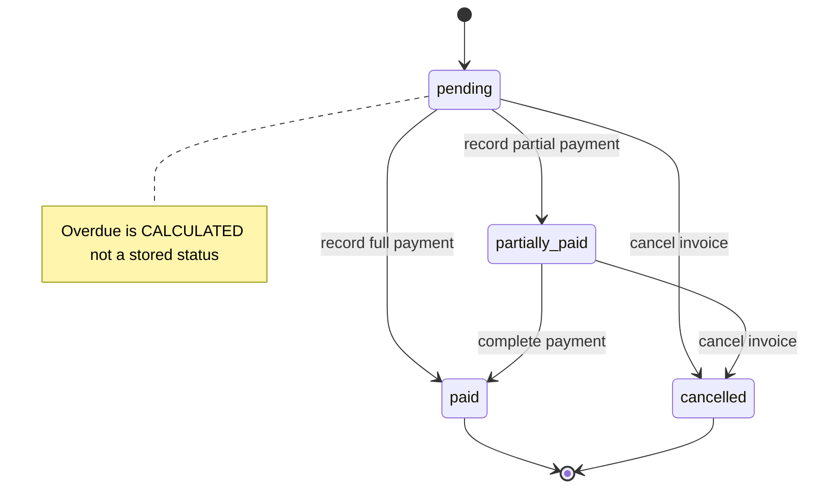
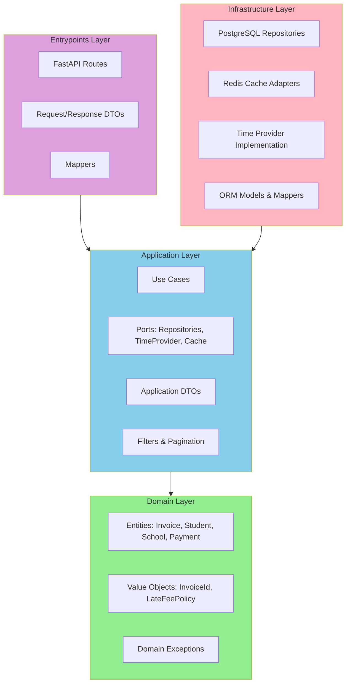

# mattilda_challenge

## Overview

**mattilda_challenge** is a production-shaped backend service designed to demonstrate **senior-level engineering judgment** through correctness, clarity, and architectural discipline rather than feature breadth.

This project focuses on modeling a school billing system with strong emphasis on **financial correctness**, **explicit business rules**, and **clean separation of concerns**. It implements core operations for schools, students, invoices, and payments with proper monetary handling and transactional guarantees.

The service is intentionally designed as an interview-grade system: small in scope, but deep in engineering rigor. It focuses on the hardest parts of real billing systems—monetary precision, state management, and account reconciliation—rather than breadth of features.

---

## Domain

The system models the billing lifecycle for educational institutions:

- **Schools**: Educational institutions that enroll students
- **Students**: Individuals enrolled in a school with billing accounts
- **Invoices**: Bills issued to students for tuition, fees, or services
- **Payments**: Monetary transactions against invoices

### Core Business Questions

The system is designed to answer:

- ¿Cuánto le debe un estudiante a un colegio? (How much does a student owe a school?)
- ¿Cuánto le deben todos los estudiantes a un colegio? (How much do all students owe a school?)
- ¿Cuántos alumnos tiene un colegio? (How many students does a school have?)
- ¿Cuál es el estado de cuenta de un colegio o estudiante? (What is the account statement for a school or student?)

---

## Goals

The primary goals of this project are:

- Demonstrate **incremental system evolution** without regressions
- Apply **Clean Architecture** to isolate business rules from infrastructure
- Use **Architecture Decision Records (ADRs)** as first-class artifacts
- Enforce correctness through **explicit invariants and contracts**
- Handle **monetary values with Decimal precision** (never floats)
- Favor **clarity and explainability** over cleverness
- Produce an interview-grade codebase that scales conceptually

This project is also meant to serve as a **demonstration of production-ready practices** for technical assessments.

---

## Core Invariants

This project follows strict architectural principles (see [ADR-001](docs/adrs/ADR-001-project-initialization.md) and [ADR-002](docs/adrs/ADR-002-domain-model.md)):

- **Domain is immutable**: All entities and value objects use `frozen=True` dataclasses with copy-on-write pattern
- **Monetary values use Decimal**: NEVER float - all money uses Python's `Decimal` for exact arithmetic
- **Time is injected**: Domain never accesses the clock; time is always injected as a parameter from `TimeProvider`
- **All datetimes are UTC**: Validated at construction via `validate_utc_timestamp()` guard
- **IDs are UUID value objects**: Type-safe identifiers (InvoiceId, StudentId, etc.) prevent ID confusion
- **Infrastructure is replaceable**: Domain has zero dependencies on frameworks or databases
- **Types are explicit**: All functions have complete type hints; mypy strict mode enforced
- **Ports use ABC**: All repository interfaces enforce contracts at runtime via Abstract Base Classes

These invariants ensure correctness, testability, and maintainability. See [CONTRIBUTING.md](CONTRIBUTING.md#domain-invariants-must-not-be-violated) for enforcement rules.

---

## Scope Boundaries

### In Scope (48-hour challenge)

- ✅ Full CRUD for Schools, Students, Invoices, Payments
- ✅ Account statements (student and school level)
- ✅ Late fee calculation with configurable policies
- ✅ Partial payment support
- ✅ Redis caching for account statements
- ✅ Offset-based pagination with filtering and sorting
- ✅ Observability (structured logging, health checks, Prometheus metrics)
- ✅ Complete test coverage (unit + integration)
- ✅ Docker Compose local development

### Out of Scope (intentionally deferred)

- ❌ **Authentication/Authorization** — Adds significant complexity; deferred to keep focus on core billing logic
- ❌ **Frontend** — Backend-only challenge; API is designed to support any frontend
- ❌ Multi-currency support or FX handling
- ❌ Complex payment plans or installment schedules
- ❌ External payment gateway integrations
- ❌ Student enrollment workflows
- ❌ Grade/academic tracking
- ❌ Distributed tracing (OpenTelemetry/Jaeger)

---

## Core Concepts

### Financial Correctness

All monetary values use **Decimal arithmetic** to ensure exact calculations:

- Invoice amounts: `Decimal("1500.00")`
- Payment amounts: `Decimal("500.00")`
- Account balances: Calculated precisely, no floating-point drift

See: **[ADR-002: Monetary Values](docs/adrs/ADR-002-domain-model.md#1-monetary-values---decimal-arithmetic-system-wide)**

### Domain Model

#### Schools
- Represent educational institutions
- Have many students
- Track aggregate billing across all students

#### Students
- Enrolled in exactly one school (immutable relationship)
- Have billing accounts with invoices
- Can have multiple outstanding invoices

#### Invoices
- Issued to students for amounts owed
- Have states: `pending`, `partially_paid`, `paid`, `cancelled`
- Track due dates and late fee policies
- **Overdue is calculated**, not stored (computed from `due_date` and current time)

#### Payments
- Record monetary transactions against invoices
- Support partial payments (multiple payments per invoice)
- **Immutable once created** (append-only audit trail)

### Late Fee Calculation

Late fees are calculated using a **LateFeePolicy** value object that encapsulates the business rule: fees apply to the **original invoice amount**, not the remaining balance.

```python
# Late fee formula
monthly_fee = original_amount × monthly_rate
daily_fee = monthly_fee / 30
total_fee = daily_fee × days_overdue
```

See: **[ADR-002: Late Fee Policy](docs/adrs/ADR-002-domain-model.md#6-late-fee-calculation)**

### State Management

Invoices follow explicit state transitions:



**Note**: `overdue` is not a stored status—it's computed dynamically by comparing `due_date` with the current time. This ensures the system is always correct without background jobs.

### Account Statements

Account statements provide financial summaries:

**Student Statement**:
- Total invoiced amount
- Total paid amount
- Total pending amount
- Breakdown by invoice status
- Total late fees (calculated for overdue invoices)

**School Statement**:
- Aggregate across all students
- Total student count
- Billing health metrics

---

## Architecture

The project follows **Clean Architecture** principles:



**Dependency Rule**: Dependencies point **inward only**. Domain has zero knowledge of outer layers.

| Allowed | Forbidden |
|---------|-----------|
| Entrypoints → Application ✅ | Domain → Application ❌ |
| Entrypoints → Domain ✅ | Domain → Infrastructure ❌ |
| Infrastructure → Application ✅ | Application → Entrypoints ❌ |
| Infrastructure → Domain ✅ | Application → Infrastructure ❌ |
| Application → Domain ✅ | |

---

## Technology Stack

| Component | Choice | Version |
|-----------|--------|---------|
| Language | Python | 3.14 |
| Framework | FastAPI | Latest |
| Database | PostgreSQL | 16+ |
| ORM & Migrations | SQLAlchemy (async) + Alembic | 2.0+ |
| Cache | Redis | 7+ |
| Containerization | Docker + Docker Compose | Latest |
| Testing | pytest | Latest |
| Linting | ruff | Latest |
| Type Checking | mypy (strict mode) | Latest |
| Logging | structlog | 24.1+ |
| Metrics | prometheus-fastapi-instrumentator | 7.0+ |
| Dependency Management | [uv](https://docs.astral.sh/uv/) | Latest |

All components are designed to run locally via Docker with zero host dependencies.

---

## Project Structure

```
mattilda_challenge/
├── src/
│   └── mattilda_challenge/
│       ├── domain/
│       │   ├── entities/
│       │   │   ├── school.py
│       │   │   ├── student.py
│       │   │   ├── invoice.py
│       │   │   └── payment.py
│       │   ├── value_objects/
│       │   │   ├── ids.py              # InvoiceId, StudentId, etc.
│       │   │   ├── invoice_status.py
│       │   │   ├── student_status.py
│       │   │   └── late_fee_policy.py
│       │   └── exceptions.py
│       ├── application/
│       │   ├── use_cases/
│       │   │   ├── create_school.py
│       │   │   ├── create_student.py
│       │   │   ├── create_invoice.py
│       │   │   ├── record_payment.py
│       │   │   ├── get_student_account_statement.py
│       │   │   └── get_school_account_statement.py
│       │   ├── ports/
│       │   │   ├── time_provider.py
│       │   │   ├── school_repository.py
│       │   │   ├── student_repository.py
│       │   │   ├── invoice_repository.py
│       │   │   ├── payment_repository.py
│       │   │   └── account_statement_cache.py
│       │   ├── filters.py              # Entity-specific filter dataclasses
│       │   ├── common.py               # Page[T], PaginationParams, SortParams
│       │   └── dtos/
│       │       └── account_statement.py
│       ├── infrastructure/
│       │   ├── postgres/
│       │   │   ├── models/
│       │   │   ├── mappers/
│       │   │   ├── connection.py
│       │   │   └── unit_of_work.py
│       │   ├── redis/
│       │   │   └── client.py
│       │   ├── adapters/
│       │   │   ├── school_repository/
│       │   │   │   ├── postgres.py
│       │   │   │   └── in_memory.py
│       │   │   ├── student_repository/
│       │   │   │   ├── postgres.py
│       │   │   │   └── in_memory.py
│       │   │   ├── invoice_repository/
│       │   │   │   ├── postgres.py
│       │   │   │   └── in_memory.py
│       │   │   ├── payment_repository/
│       │   │   │   ├── postgres.py
│       │   │   │   └── in_memory.py
│       │   │   ├── time_provider.py
│       │   │   └── account_statement_cache.py
│       │   └── observability/
│       │       ├── logging.py
│       │       ├── request_id.py
│       │       └── metrics.py
│       └── entrypoints/
│           └── http/
│               ├── routes/
│               │   ├── schools.py
│               │   ├── students.py
│               │   ├── invoices.py
│               │   ├── payments.py
│               │   └── health.py
│               ├── dtos/
│               ├── mappers/
│               └── app.py
├── tests/
│   ├── unit/
│   └── integration/
├── docs/
│   └── adrs/
├── alembic/
├── docker-compose.yml
├── Dockerfile
├── pyproject.toml
├── uv.lock
├── Makefile
└── README.md
```

---

## Quick Start

### Prerequisites

- Docker & Docker Compose

### Setup and Run

All operations run through Docker via `make` commands:

```bash
# Start all services (database, redis, backend)
make up

# Run migrations
make migrate

# Access API documentation
open http://localhost:8000/docs
```

---

## Commands

All development tasks are executed through Docker containers using `make` commands:

| Command | Description |
|---------|-------------|
| **Development** | |
| `make up` | Start all services (API, PostgreSQL, Redis) |
| `make down` | Stop all services |
| `make restart` | Restart all services |
| `make logs` | Tail logs from all services |
| `make logs-api` | Tail logs from API only |
| `make ps` | Show running containers |
| `make shell` | Open shell inside API container |
| **Dependencies** | |
| `make lock` | Generate/update uv.lock file |
| `make sync` | Install dependencies from lockfile |
| **Database** | |
| `make migrate` | Run database migrations |
| `make migrate-create NAME=...` | Create new migration |
| `make migrate-rollback` | Rollback one migration step |
| `make seed` | Load seed data into database |
| `make db-shell` | Open PostgreSQL shell |
| **Testing** | |
| `make test` | Run unit tests (default, no DB required) |
| `make test-unit` | Run unit tests only (alias for test) |
| `make test-integration` | Run integration tests (requires DB) |
| `make test-all` | Run all tests (unit + integration) |
| `make test-file FILE=...` | Run specific test file |
| `make test-coverage` | Run tests with coverage (unit only) |
| **Code Quality** | |
| `make lint` | Run ruff check |
| `make lint-fix` | Run ruff with auto-fix |
| `make fmt` | Format code with ruff |
| `make typecheck` | Run mypy strict type checking |
| `make check` | Run lint + typecheck + test |

---

## API Documentation

Interactive API documentation is automatically generated:

- **Swagger UI**: http://localhost:8000/docs
- **ReDoc**: http://localhost:8000/redoc
- **OpenAPI JSON**: http://localhost:8000/openapi.json

### Main Endpoints

#### Schools
| Method | Endpoint | Description |
|--------|----------|-------------|
| GET | `/api/v1/schools` | List schools (paginated) |
| POST | `/api/v1/schools` | Create school |
| GET | `/api/v1/schools/{id}` | Get school details |
| PUT | `/api/v1/schools/{id}` | Update school |
| DELETE | `/api/v1/schools/{id}` | Delete school |
| GET | `/api/v1/schools/{id}/account-statement` | School account statement (cached) |

#### Students
| Method | Endpoint | Description |
|--------|----------|-------------|
| GET | `/api/v1/students` | List students (paginated) |
| POST | `/api/v1/students` | Create student |
| GET | `/api/v1/students/{id}` | Get student details |
| PUT | `/api/v1/students/{id}` | Update student |
| DELETE | `/api/v1/students/{id}` | Delete student |
| GET | `/api/v1/students/{id}/account-statement` | Student account statement (cached) |

#### Invoices
| Method | Endpoint | Description |
|--------|----------|-------------|
| GET | `/api/v1/invoices` | List invoices (paginated) |
| POST | `/api/v1/invoices` | Create invoice |
| GET | `/api/v1/invoices/{id}` | Get invoice details |
| PUT | `/api/v1/invoices/{id}` | Update invoice |
| DELETE | `/api/v1/invoices/{id}` | Delete invoice |
| POST | `/api/v1/invoices/{id}/cancel` | Cancel invoice |

#### Payments
| Method | Endpoint | Description |
|--------|----------|-------------|
| GET | `/api/v1/payments` | List payments (paginated) |
| POST | `/api/v1/payments` | Record payment against invoice |
| GET | `/api/v1/payments/{id}` | Get payment details |

#### Health & Monitoring
| Method | Endpoint | Description |
|--------|----------|-------------|
| GET | `/health` | Full health check (DB + Redis) |
| GET | `/health/live` | Liveness probe |
| GET | `/health/ready` | Readiness probe |
| GET | `/metrics` | Prometheus metrics |

---

## Observability

The system implements production-ready observability following the "three pillars" approach:

### Structured Logging

- **Development**: Colored console output for human readability
- **Production**: JSON lines for log aggregation (stdout per 12-factor app)
- **Request correlation**: All logs include `request_id` for tracing

```json
{
  "timestamp": "2024-01-20T15:00:00.000000Z",
  "level": "info",
  "message": "invoice_created",
  "request_id": "abc-123-def",
  "student_id": "550e8400-e29b-41d4-a716-446655440000",
  "amount": "150.00"
}
```

### Health Checks

| Endpoint | Purpose | Checks |
|----------|---------|--------|
| `/health/live` | Liveness probe | Application responds |
| `/health/ready` | Readiness probe | Can accept traffic |
| `/health` | Full health | Database + Redis connectivity |

### Prometheus Metrics

Available at `/metrics`:
- `http_request_duration_seconds` - Request latency histogram
- `http_requests_total` - Request counter by method/path/status
- Custom business metrics (optional)

See: **[ADR-008: Observability Strategy](docs/adrs/ADR-008-observability.md)**

---

## Caching Strategy

Account statements are cached in Redis with TTL-based invalidation:

- **TTL**: 300 seconds (5 minutes)
- **Pattern**: Cache-aside (check cache → compute if miss → cache result)
- **Fail-open**: Cache failures don't break the application

```
Cache Key Format:
mattilda:cache:v1:account_statement:student:{uuid}
mattilda:cache:v1:account_statement:school:{uuid}
```

See: **[ADR-006: Redis Caching Strategy](docs/adrs/ADR-006-caching-strategy.md)**

---

## Architecture Decision Records

All significant architectural decisions are documented in ADRs:

| ADR | Title | Status |
|-----|-------|--------|
| [ADR-001](docs/adrs/ADR-001-project-initialization.md) | Project Initialization & Structure | Implemented |
| [ADR-002](docs/adrs/ADR-002-domain-model.md) | Domain Model Design | Implemented |
| [ADR-003](docs/adrs/ADR-003-time-provider.md) | Time Provider Interface and Implementation | Implemented |
| [ADR-004](docs/adrs/ADR-004-postgresql-persistence.md) | PostgreSQL Persistence with SQLAlchemy and Alembic | Implemented |
| [ADR-005](docs/adrs/ADR-005-rest-api-design.md) | REST API Design | Accepted |
| [ADR-006](docs/adrs/ADR-006-caching-strategy.md) | Redis Caching for Account Statements | Accepted |
| [ADR-007](docs/adrs/ADR-007-pagination.md) | Offset-Based Pagination | Implemented |
| [ADR-008](docs/adrs/ADR-008-observability.md) | Observability Strategy | Accepted |
| [ADR-009](docs/ADR-009.md) | Repository Port and Adapter Implementation | Implemented |
| [ADR-010](docs/ADR-010.md) | UseCase Pattern and Error Handling Strategy | Accepted |

---

## Key Design Principles

### 1. Monetary Values (CRITICAL INVARIANT)

All monetary values use **Decimal arithmetic** (never float):

```python
from decimal import Decimal

# ✅ Correct
invoice_amount = Decimal("1500.00")
payment_amount = Decimal("500.00")
balance = invoice_amount - payment_amount  # Exact: Decimal("1000.00")

# ✅ Exact equality in tests
assert balance == Decimal("1000.00")

# ❌ Wrong - float precision loss
invoice_amount = 1500.00  # Binary floating-point
balance = 1500.00 - 500.00  # May be 999.9999999999...

# ❌ Wrong - approximate equality (never for money)
assert balance == pytest.approx(1000.00)
```

### 2. Time Injection

Domain never accesses the clock directly. Time is always injected from `TimeProvider`:

```python
# ✅ Correct: Time as parameter
def calculate_late_fee(self, now: datetime) -> Decimal:
    if not self.is_overdue(now):
        return Decimal("0.00")
    return self.late_fee_policy.calculate_fee(self.amount, self.due_date, now)

# ❌ Wrong: Domain accessing clock
def calculate_late_fee(self) -> Decimal:
    now = datetime.now(UTC)  # Domain should NOT access clock directly!
```

See: **[ADR-003: Time Provider](docs/adrs/ADR-003-time-provider.md)**

### 3. Immutability and Copy-on-Write

All domain entities are immutable (`frozen=True` dataclasses). State changes return new instances:

```python
from dataclasses import replace

# Domain entity (immutable)
@dataclass(frozen=True, slots=True)
class Invoice:
    status: InvoiceStatus
    
    def mark_as_paid(self, now: datetime) -> Invoice:
        """Return NEW invoice with status PAID (original unchanged)."""
        return replace(self, status=InvoiceStatus.PAID, updated_at=now)

# Usage
paid_invoice = invoice.mark_as_paid(now)
assert invoice.status == InvoiceStatus.PENDING      # ✅ Original unchanged
assert paid_invoice.status == InvoiceStatus.PAID    # ✅ New instance
```

### 4. Unit of Work Pattern

Financial operations that span multiple repositories use Unit of Work for atomicity:

```python
async with uow:
    payment = Payment.create(...)
    await uow.payments.save(payment)
    
    invoice = await uow.invoices.get_by_id(invoice_id, for_update=True)
    updated_invoice = invoice.update_status(new_status, now)
    await uow.invoices.save(updated_invoice)
    
    await uow.commit()  # All or nothing
```

See: **[ADR-004: PostgreSQL Persistence](docs/adrs/ADR-004-postgresql-persistence.md)**

---

## Testing Strategy

### Testing Philosophy

- **Unit tests** for business logic (domain, use cases)
- **Integration tests** for infrastructure (DB, API)
- **No mocks for domain** - use real objects
- **Test doubles for infrastructure** - in-memory repositories for unit tests
- **Deterministic tests** - no random data in assertions

### Test Data

Always use explicit values, never randomization:

```python
# ✅ Correct: Explicit, reproducible
invoice = Invoice.create(
    student_id=StudentId.from_string("550e8400-e29b-41d4-a716-446655440000"),
    amount=Decimal("1500.00"),
    due_date=datetime(2024, 2, 1, tzinfo=UTC),
    ...
)

# ❌ Wrong: Random data (non-deterministic)
invoice = Invoice.create(
    amount=Decimal(str(random.uniform(100, 10000))),
    ...
)
```

For detailed testing guidelines, see [CONTRIBUTING.md](CONTRIBUTING.md#testing-guidelines).

---

## Status

🚧 **Work in progress** — project is built incrementally by stages.

### Current Stage

All ADRs have been written and accepted. Implementation is in progress.

**Completed**:
- ✅ All 9 ADRs written and accepted
- ✅ Project structure and core invariants defined
- ✅ CONTRIBUTING.md with coding standards
- ✅ ADR-001: Project Initialization & Structure
- ✅ ADR-002: Domain Model Design
- ✅ ADR-003: Time Provider (port and adapters)
- ✅ ADR-007: Pagination types (`PaginationParams`, `SortParams`, `Page[T]`, filter dataclasses)
- ✅ ADR-009: Repository ports, PostgreSQL adapters, and in-memory adapters (with unit and integration tests)

**Implementation Roadmap**:
- [x] **Stage 1**: Domain model with entities and value objects
- [x] **Stage 2**: Repository pattern and database persistence
- [ ] **Stage 3**: Use cases and application logic
- [ ] **Stage 4**: REST API endpoints with OpenAPI docs
- [ ] **Stage 5**: Caching and pagination
- [ ] **Stage 6**: Observability (logging, health checks, metrics)
- [ ] **Stage 7**: Integration testing and documentation

---

## License

MIT License (for challenge purposes)
