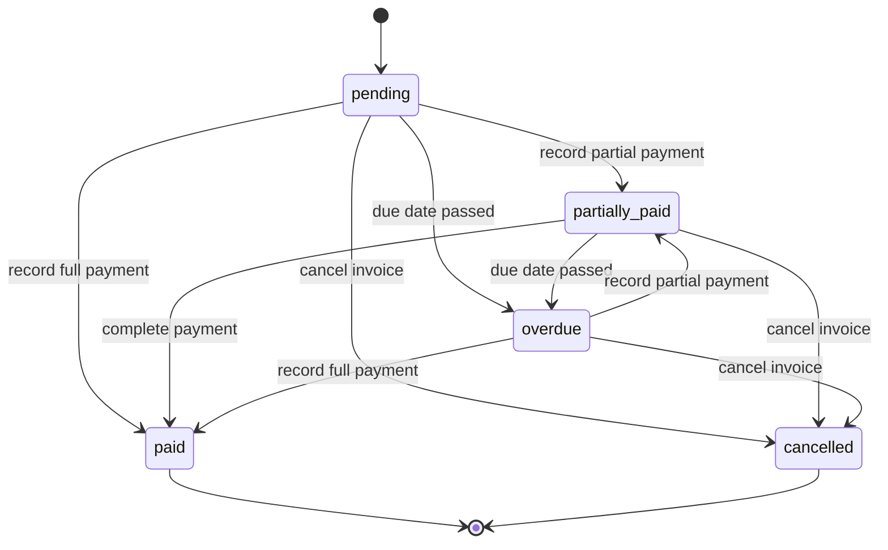
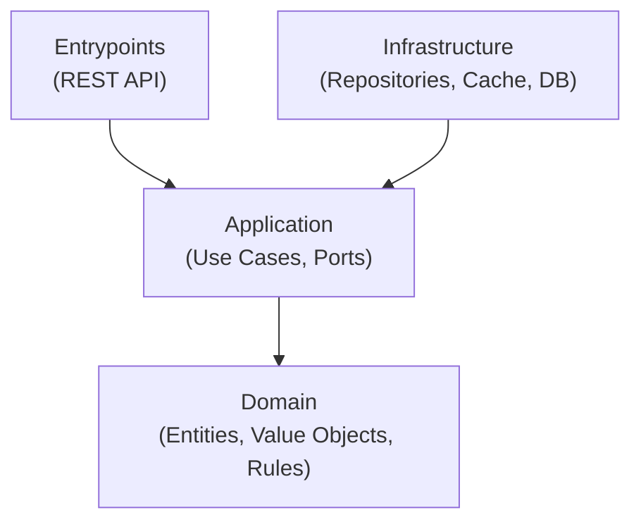

# mattilda_challenge

## Overview

**mattilda_challenge** is a production-shaped backend service designed to demonstrate **senior-level engineering judgment** through correctness, clarity, and architectural discipline rather than feature breadth.

This project focuses on modeling a school billing system with strong emphasis on **financial correctness**, **explicit business rules**, and **clean separation of concerns**. It implements core operations for schools, students, invoices, and payments with proper monetary handling and transactional guarantees.

The service is intentionally designed as an interview-grade system: small in scope, but deep in engineering rigor. It focuses on the hardest parts of real billing systems—monetary precision, state management, and account reconciliation—rather than breadth of features.

---

## Domain

The system models the billing lifecycle for educational institutions:

- **Schools**: Educational institutions that enroll students
- **Students**: Individuals enrolled in a school with billing accounts
- **Invoices**: Bills issued to students for tuition, fees, or services
- **Payments**: Monetary transactions against invoices

### Core Business Questions

The system is designed to answer:

- ¿Cuánto le debe un estudiante a un colegio? (How much does a student owe a school?)
- ¿Cuánto le deben todos los estudiantes a un colegio? (How much do all students owe a school?)
- ¿Cuántos alumnos tiene un colegio? (How many students does a school have?)
- ¿Cuál es el estado de cuenta de un colegio o estudiante? (What is the account statement for a school or student?)

---

## Goals

The primary goals of this project are:

- Demonstrate **incremental system evolution** without regressions
- Apply **Clean Architecture** to isolate business rules from infrastructure
- Use **Architecture Decision Records (ADRs)** as first-class artifacts
- Enforce correctness through **explicit invariants and contracts**
- Handle **monetary values with Decimal precision** (never floats)
- Favor **clarity and explainability** over cleverness
- Produce an interview-grade codebase that scales conceptually

This project is also meant to serve as a **demonstration of production-ready practices** for technical assessments.

---

## Non-Goals (for this challenge)

- Multi-currency support or FX handling
- Complex payment plans or installment schedules
- External payment gateway integrations
- Student enrollment workflows
- Grade/academic tracking
- Over-engineering beyond stated scope
- Premature optimization or speculative abstractions

---

## Core Concepts

### Financial Correctness

All monetary values use **Decimal arithmetic** to ensure exact calculations:

- Invoice amounts: `Decimal("1500.00")`
- Payment amounts: `Decimal("500.00")`
- Account balances: Calculated precisely, no floating-point drift

See: **ADR-003: Monetary Values & Decimal Arithmetic**

### Domain Model

#### Schools
- Represent educational institutions
- Have many students
- Track aggregate billing across all students

#### Students
- Enrolled in exactly one school
- Have billing accounts with invoices
- Can have multiple outstanding invoices

#### Invoices
- Issued to students for amounts owed
- Have states: `pending`, `partially_paid`, `paid`, `overdue`, `cancelled`
- Track due dates and payment history

#### Payments
- Record monetary transactions against invoices
- Support partial payments (multiple payments per invoice)
- Immutable once created (audit trail)

### State Management

Invoices follow explicit state transitions:



### Account Statements

Account statements provide financial summaries:

**Student Statement**:
- Total invoiced amount
- Total paid amount
- Total pending amount
- Breakdown by invoice status

**School Statement**:
- Aggregate across all students
- Total student count
- Billing health metrics

---

## Architecture

The project follows **Clean Architecture** principles:

- **Domain**: entities, value objects, business rules, invariants
- **Application**: use cases (e.g., `CreateInvoice`, `RecordPayment`), ports (abstract interfaces)
- **Infrastructure**: database repositories, cache, external services
- **Entrypoints**: HTTP API layer (FastAPI)

Business rules do not depend on frameworks, databases, or delivery mechanisms.



**Dependency Rule**: Dependencies point **inward only**. Domain has zero knowledge of outer layers.

---

## Technology Stack

- **Language**: Python 3.14
- **Framework**: FastAPI
- **Database**: PostgreSQL
- **ORM & Migrations**: SQLAlchemy (async) + Alembic
- **Cache**: Redis
- **Containerization**: Docker + Docker Compose
- **Testing**: pytest
- **Linting**: ruff
- **Type Checking**: mypy (strict mode)
- **Dependency Management**: [uv](https://docs.astral.sh/uv/)

All components are designed to run locally via Docker with zero host dependencies.

---

## Project Structure

```
mattilda_challenge/
├── src/
│   └── mattilda_challenge/
│       ├── domain/
│       │   ├── entities/
│       │   │   ├── school.py           # School entity
│       │   │   ├── student.py          # Student entity with enrollment
│       │   │   ├── invoice.py          # Invoice entity with state machine
│       │   │   └── payment.py          # Payment entity (immutable)
│       │   ├── value_objects/
│       │   │   ├── money.py            # Money value object (Decimal)
│       │   │   ├── invoice_status.py   # InvoiceStatus enum
│       │   │   └── student_status.py   # StudentStatus enum
│       │   ├── ports/
│       │   │   ├── school_repository.py
│       │   │   ├── student_repository.py
│       │   │   ├── invoice_repository.py
│       │   │   └── payment_repository.py
│       │   └── exceptions.py           # Domain exception hierarchy
│       ├── application/
│       │   ├── use_cases/
│       │   │   ├── create_school.py
│       │   │   ├── create_student.py
│       │   │   ├── create_invoice.py
│       │   │   ├── record_payment.py
│       │   │   ├── get_student_account_statement.py
│       │   │   └── get_school_account_statement.py
│       │   └── dtos/
│       │       ├── school_dto.py
│       │       ├── student_dto.py
│       │       ├── invoice_dto.py
│       │       └── account_statement_dto.py
│       ├── infrastructure/
│       │   ├── postgres/               # PostgreSQL-specific concerns
│       │   │   ├── models/
│       │   │   │   ├── school_model.py
│       │   │   │   ├── student_model.py
│       │   │   │   ├── invoice_model.py
│       │   │   │   └── payment_model.py
│       │   │   └── connection.py
│       │   ├── redis/                  # Redis-specific concerns
│       │   │   └── client.py
│       │   └── adapters/               # Port implementations (tool-agnostic)
│       │       ├── school_repository.py
│       │       ├── student_repository.py
│       │       ├── invoice_repository.py
│       │       └── payment_repository.py
│       └── entrypoints/
│           └── http/
│               ├── routes/
│               │   ├── schools.py
│               │   ├── students.py
│               │   ├── invoices.py
│               │   └── payments.py
│               ├── dtos/
│               │   ├── school_dtos.py
│               │   ├── student_dtos.py
│               │   ├── invoice_dtos.py
│               │   └── payment_dtos.py
│               ├── mappers/
│               │   ├── school_mapper.py
│               │   ├── student_mapper.py
│               │   ├── invoice_mapper.py
│               │   └── payment_mapper.py
│               └── app.py
├── tests/
│   ├── unit/
│   │   ├── domain/
│   │   │   ├── entities/
│   │   │   │   ├── test_school.py
│   │   │   │   ├── test_student.py
│   │   │   │   ├── test_invoice.py
│       │   │   └── test_payment.py
│   │   │   └── value_objects/
│   │   │       ├── test_money.py
│   │   │       └── test_invoice_status.py
│   │   ├── application/
│   │   │   └── use_cases/
│   │   │       ├── test_create_invoice.py
│   │   │       ├── test_record_payment.py
│   │   │       └── test_get_account_statement.py
│   │   └── infrastructure/
│   │       └── adapters/
│   │           └── test_repositories.py
│   └── integration/
│       └── test_api_endpoints.py
├── docs/
│   ├── adrs/
│   │   ├── ADR-001-project-initialization.md
│   │   ├── ADR-002-domain-model.md
│   │   ├── ADR-003-monetary-values.md
│   │   ├── ADR-004-repository-pattern.md
│   │   ├── ADR-005-caching-strategy.md
│   │   └── ADR-006-pagination.md
│   └── api/
│       └── openapi.json
├── alembic/
│   ├── versions/
│   └── env.py
├── scripts/
│   └── seed_data.py
├── docker-compose.yml
├── Dockerfile
├── pyproject.toml
├── uv.lock
├── Makefile
└── README.md
```

---

## Quick Start

### Prerequisites

- Docker & Docker Compose

### Setup and Run

All operations run through Docker via `make` commands:

```bash
# Start all services (database, redis, backend)
make up

# Access API documentation
open http://localhost:8000/docs
```

---

## Commands

All development tasks are executed through Docker containers using `make` commands:

| Command | Description |
|---------|-------------|
| **Development** |
| `make up` | Start all services (API, PostgreSQL, Redis) |
| `make down` | Stop all services |
| `make restart` | Restart all services |
| `make logs` | Tail logs from all services |
| `make logs-api` | Tail logs from API only |
| `make ps` | Show running containers |
| `make shell` | Open shell inside API container |
| **Dependencies** |
| `make lock` | Generate/update uv.lock file |
| `make sync` | Install dependencies from lockfile |
| **Database** |
| `make migrate` | Run database migrations |
| `make migrate-create NAME=...` | Create new migration |
| `make seed` | Load seed data into database |
| `make db-shell` | Open PostgreSQL shell |
| **Testing** |
| `make test` | Run all tests |
| `make test-unit` | Run unit tests only |
| `make test-integration` | Run integration tests only |
| `make test-file FILE=...` | Run specific test file |
| `make test-coverage` | Run tests with coverage report |
| **Code Quality** |
| `make lint` | Run ruff check |
| `make lint-fix` | Run ruff with auto-fix |
| `make fmt` | Format code with ruff |
| `make typecheck` | Run mypy strict type checking |
| `make check` | Run lint + typecheck + test |

---

## Dependency Management

Dependencies are managed with **[uv](https://docs.astral.sh/uv/)** and fully locked.

Workflow:

```bash
make lock
make sync
git add pyproject.toml uv.lock
git commit -m "update dependencies"
```

All environments (local, CI, production) install dependencies strictly from the lockfile.

---

## API Documentation

Interactive API documentation is automatically generated:

- **Swagger UI**: http://localhost:8000/docs
- **ReDoc**: http://localhost:8000/redoc
- **OpenAPI JSON**: http://localhost:8000/openapi.json

### Main Endpoints

#### Schools
- `GET /api/v1/schools` - List schools (paginated)
- `POST /api/v1/schools` - Create school
- `GET /api/v1/schools/{id}` - Get school details
- `PUT /api/v1/schools/{id}` - Update school
- `DELETE /api/v1/schools/{id}` - Delete school
- `GET /api/v1/schools/{id}/account-statement` - School account statement (cached)

#### Students
- `GET /api/v1/students` - List students (paginated)
- `POST /api/v1/students` - Create student
- `GET /api/v1/students/{id}` - Get student details
- `PUT /api/v1/students/{id}` - Update student
- `DELETE /api/v1/students/{id}` - Delete student
- `GET /api/v1/students/{id}/account-statement` - Student account statement (cached)

#### Invoices
- `GET /api/v1/invoices` - List invoices (paginated)
- `POST /api/v1/invoices` - Create invoice
- `GET /api/v1/invoices/{id}` - Get invoice details
- `PUT /api/v1/invoices/{id}` - Update invoice
- `DELETE /api/v1/invoices/{id}` - Delete invoice

#### Payments
- `POST /api/v1/payments` - Record payment against invoice
- `GET /api/v1/payments/{id}` - Get payment details

#### Health & Monitoring
- `GET /health` - Health check endpoint
- `GET /metrics` - Prometheus metrics (optional)

---

## Development Approach

The project is developed **incrementally by stages**, each accompanied by an **Architecture Decision Record (ADR)**.

Each stage:

- Introduces **one core concept**
- Is reviewed against **explicit invariants**
- Preserves guarantees from previous stages
- Avoids regressions by construction

This ensures the system evolves correctly without breaking existing guarantees.

---

## Architecture Decision Records

All significant architectural decisions are documented in ADRs.

| ADR | Title | Status |
|-----|-------|--------|
| [ADR-001](docs/adrs/ADR-001-project-initialization.md) | Project Initialization & Structure | Planned |
| [ADR-002](docs/adrs/ADR-002-domain-model.md) | Domain Model Design | Planned |
| [ADR-003](docs/adrs/ADR-003-monetary-values.md) | Monetary Values & Decimal Arithmetic | Planned |
| [ADR-004](docs/adrs/ADR-004-repository-pattern.md) | Repository Pattern with ABC | Planned |
| [ADR-005](docs/adrs/ADR-005-caching-strategy.md) | Redis Caching for Account Statements | Planned |
| [ADR-006](docs/adrs/ADR-006-pagination.md) | Offset-Based Pagination | Planned |
| [ADR-007](docs/adrs/ADR-007-authentication.md) | JWT Authentication (Optional) | Planned |

---

## Key Design Principles

### 1. Monetary Values (CRITICAL INVARIANT)

All monetary values use **Decimal arithmetic** (never float):

```python
from decimal import Decimal

# ✅ Correct
invoice_amount = Decimal("1500.00")
payment_amount = Decimal("500.00")

# ❌ Wrong - precision loss
invoice_amount = 1500.00  # float causes rounding errors
```

**Enforcement**:
- Domain entities use `Decimal` for all amounts
- Database uses `NUMERIC(12, 2)` for all monetary columns
- API accepts strings, converts to `Decimal` at boundary
- Tests verify exact equality (no `assertAlmostEqual`)

See: **ADR-003: Monetary Values & Decimal Arithmetic**

### 2. Repository Pattern with ABC

All repositories defined as Abstract Base Classes:

```python
from abc import ABC, abstractmethod

class InvoiceRepository(ABC):
    @abstractmethod
    async def get_by_id(self, invoice_id: int) -> Optional[Invoice]:
        ...

    @abstractmethod
    async def save(self, invoice: Invoice) -> Invoice:
        ...
```

**Benefits**:
- Runtime enforcement of interface contracts
- Explicit architectural relationships
- Fail-fast on incomplete implementations
- Better IDE support and documentation

See: **ADR-004: Repository Pattern with ABC**

### 3. Clean Architecture Boundaries

**Dependency Rule**: Source code dependencies point **inward only**.

```
Allowed:
  Entrypoints → Application → Domain ✅
  Infrastructure → Application ✅
  Infrastructure → Domain ✅

Forbidden:
  Domain → Application ❌
  Domain → Infrastructure ❌
  Application → Entrypoints ❌
```

**Enforcement**:
- Import checks in tests
- Code review
- Mypy strict mode

### 4. Explicit State Machines

Domain entities with states use explicit transition rules:

```python
class Invoice:
    def mark_as_paid(self) -> None:
        if self.status not in [InvoiceStatus.PENDING, InvoiceStatus.PARTIALLY_PAID]:
            raise InvalidStateTransition(
                f"Cannot mark as paid from status: {self.status}"
            )
        self.status = InvoiceStatus.PAID
```

Illegal transitions are rejected by design.

---

## Testing Strategy

### Testing Philosophy

- **Unit tests** for business logic (domain, use cases)
- **Integration tests** minimal but critical (DB, API)
- **No mocks for domain** - use real objects
- **Test doubles for infrastructure** - in-memory repositories for unit tests
- **Deterministic tests** - no random data in assertions

---

## Status

🚧 **Work in progress** — project is intentionally built step by step.

### Current Stage

**Stage 0: Planning & ADRs**

Next steps:
1. Write ADR-001 through ADR-004
2. Implement domain layer (entities, value objects)
3. Implement application layer (use cases, ports)
4. Implement infrastructure layer (repositories, cache)
5. Implement entrypoints (FastAPI routes)
6. Add observability (logging, health checks)

### Roadmap

- [ ] **Stage 1**: Domain model with entities and value objects
- [ ] **Stage 2**: Repository pattern and database persistence
- [ ] **Stage 3**: Use cases and application logic
- [ ] **Stage 4**: REST API endpoints with OpenAPI docs
- [ ] **Stage 5**: Caching and pagination
- [ ] **Stage 6**: Authentication and logging
- [ ] **Stage 7**: Frontend (separate repository)

---

## License

MIT License (for challenge purposes)
