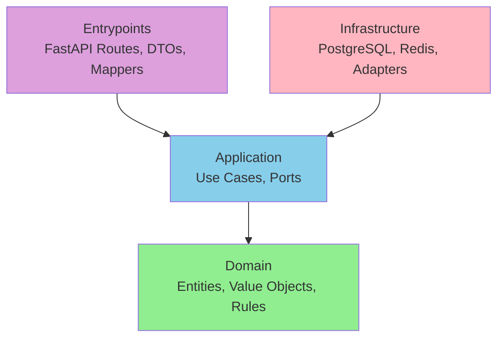
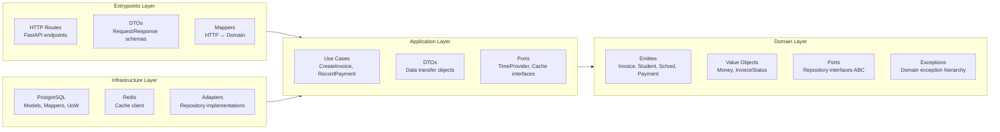

# ADR-001: Project Initialization & Structure

## Status

Implemented

## Context

This project is a technical challenge for Mattilda, designed to demonstrate senior-level engineering judgment through correctness, clarity, and architectural discipline. The system models a school billing domain (schools, students, invoices, payments) with emphasis on:

- **Financial correctness**: Exact monetary calculations without floating-point errors
- **Clean Architecture**: Strict separation of concerns and dependency direction
- **Immutability**: Entities and value objects that cannot be accidentally mutated
- **Explicitness**: Code that is clear, documented, and self-explanatory
- **Testability**: Design that enables deterministic, isolated testing

This ADR establishes the foundational decisions that affect how every line of code in this project is written. These are non-negotiable standards that ensure consistency and correctness.

**Scope**: This ADR focuses on **architectural decisions** that are difficult or impossible to change later (immutability strategy, Clean Architecture boundaries, technology choices). Detailed coding standards and style guides are documented separately in `CONTRIBUTING.md` to keep this ADR focused on high-level, irreversible decisions.

## Decision

### Core Invariants

This ADR establishes the following non-negotiable invariants:

- **Domain is immutable**: All entities and value objects use `frozen=True` dataclasses
- **Time is injected**: Domain never accesses the clock; time is always a parameter
- **Infrastructure is replaceable**: Domain has zero dependencies on frameworks or databases
- **Types are explicit**: All functions have complete type hints; mypy strict mode required
- **Ports use ABC**: All repository interfaces enforce contracts at runtime via Abstract Base Classes

These invariants ensure correctness, testability, and maintainability throughout the codebase.

---

### 1. Python Version & Tooling

| Component | Choice | Version |
|-----------|--------|---------|
| Language | Python | 3.14 |
| Dependency Management | [uv](https://docs.astral.sh/uv/) | Latest |
| Framework | FastAPI | Latest |
| Database | PostgreSQL | 16+ |
| ORM | SQLAlchemy | 2.0+ (async) |
| Migrations | Alembic | Latest |
| Cache | Redis | 7+ |
| Testing | pytest | Latest |
| Linting | ruff | Latest |
| Type Checking | mypy | Latest (strict mode) |

**Rationale**:
- **Python 3.14**: Latest stable with modern syntax (`|` for unions, match statements)
- **uv**: Fast, deterministic dependency management with lockfile
- **FastAPI**: Automatic OpenAPI docs, native async, excellent type hint support
- **PostgreSQL 16+**: ACID guarantees, robust locking, excellent Decimal support
- **SQLAlchemy 2.0**: Mature ORM with async support and explicit query API
- **Redis 7+**: Simple, fast caching for read-heavy operations

### 2. Code Style Standards

#### 2.1 Dataclasses: Immutability by Default

**Rule**: All domain objects use `@dataclass(frozen=True, slots=True)`.

```python
from __future__ import annotations
from dataclasses import dataclass
from decimal import Decimal

# ✅ Correct: Value Object
@dataclass(frozen=True, slots=True)
class Money:
    """Immutable value object for monetary amounts."""
    amount: Decimal
    currency: str = "MXN"
    
    def __post_init__(self) -> None:
        if self.amount < 0:
            raise ValueError("Amount cannot be negative")

# ✅ Correct: Entity (also frozen)
@dataclass(frozen=True, slots=True)
class Invoice:
    """Immutable entity representing a billing invoice."""
    id: int
    student_id: int
    amount: Decimal
    status: InvoiceStatus
    
    def mark_as_paid(self) -> Invoice:
        """Return new invoice with status PAID (copy-on-write)."""
        return replace(self, status=InvoiceStatus.PAID)

# ❌ Wrong: Mutable dataclass
@dataclass
class Invoice:
    status: InvoiceStatus
    
    def mark_as_paid(self) -> None:
        self.status = InvoiceStatus.PAID  # Mutation - not allowed
```

**Benefits of `frozen=True`**:
- **Immutability**: Cannot be accidentally mutated
- **Thread-safe**: No race conditions on shared instances
- **Hashable**: Can be used as dict keys or in sets
- **Correctness**: Bugs from unintended mutation are impossible

**Benefits of `slots=True`**:
- **Memory efficiency**: ~40-50% less memory per instance
- **Faster attribute access**: ~20% performance improvement
- **Prevents typos**: Cannot add attributes dynamically

**Exceptions**: ORM models in `infrastructure/postgres/models/` are mutable (SQLAlchemy requirement). These never cross into the domain layer.

#### 2.2 Copy-on-Write Pattern for Entities

Since entities are frozen, state changes return **new instances** rather than mutating self.

```python
from dataclasses import replace

@dataclass(frozen=True, slots=True)
class Invoice:
    id: int
    amount: Decimal
    status: InvoiceStatus
    updated_at: datetime
    
    def record_payment(self, payment_amount: Decimal, now: datetime) -> Invoice:
        """
        Return new invoice with updated status after payment.
        
        Does NOT mutate self. Returns new instance with changes.
        Time is passed as parameter - domain never accesses clock directly.
        """
        if payment_amount <= 0:
            raise InvalidPaymentAmount("Payment must be positive")
        
        if payment_amount > self.amount:
            raise InvalidPaymentAmount(
                f"Payment {payment_amount} exceeds invoice amount {self.amount}"
            )
        
        new_status = InvoiceStatus.PAID if payment_amount == self.amount else InvoiceStatus.PARTIALLY_PAID
        
        return replace(
            self,
            status=new_status,
            updated_at=now  # Time injected as parameter
        )
```

**Usage Pattern**:
```python
# Get original invoice
invoice = await invoice_repo.get_by_id(invoice_id)

# Create NEW invoice with changes (original unchanged)
updated_invoice = invoice.record_payment(Decimal("500.00"))

# Save new version
await invoice_repo.save(updated_invoice)

# Assertions that demonstrate immutability
assert invoice.status == InvoiceStatus.PENDING  # ✅ Original unchanged
assert updated_invoice.status == InvoiceStatus.PAID  # ✅ New instance updated
assert invoice is not updated_invoice  # ✅ Different objects
```

**Benefits**:
- **Thread-safe**: No shared mutable state
- **Testable**: Easy to verify state before and after operations
- **Auditable**: Each change is a discrete new instance
- **Transactional correctness**: If save fails, original state is intact

**Trade-offs**:
- **More memory**: Creates new instances (mitigated by `slots=True`)
- **Different paradigm**: Not traditional OOP mutation
- **Learning curve**: Team must understand copy-on-write pattern

**Pattern enforcement**: Always use `dataclasses.replace()` for creating modified copies. Never assign to attributes (frozen prevents this at runtime).

**Critical principle**: Domain entities **never access the clock directly**. Time is always injected as a parameter from use cases, which obtain it from `TimeProvider`. This ensures:
- Domain remains pure and testable
- Time is controllable in tests
- Single source of truth for time (database in production)

```python
# ✅ Correct: Time as parameter
def mark_as_paid(self, now: datetime) -> Invoice:
    return replace(self, status=InvoiceStatus.PAID, updated_at=now)

# ❌ Wrong: Domain accessing clock
def mark_as_paid(self) -> Invoice:
    return replace(self, status=InvoiceStatus.PAID, updated_at=datetime.now(UTC))
```

#### 2.3 Type Annotations

**Rule 1**: `from __future__ import annotations` in **ALL** files.

```python
# ✅ Correct: Every file starts with this
from __future__ import annotations

from decimal import Decimal

class Invoice:
    def add_payment(self, payment: Payment) -> Invoice:  # ✅ Forward reference works
        ...

# ❌ Wrong: Without future annotations
class Invoice:
    def add_payment(self, payment: "Payment") -> "Invoice":  # ❌ Strings required
        ...
```

**Benefits**:
- **Lazy evaluation**: Type hints not evaluated at runtime (faster imports)
- **Forward references**: No need for string annotations
- **PEP 563 compliance**: Modern Python standard
- **Cleaner code**: Less quote noise in type hints

**Rule 2**: Use `X | None` instead of `Optional[X]`.

```python
# ✅ Correct: Modern Python 3.14 syntax
def get_student(student_id: int) -> Student | None:
    ...

# ❌ Wrong: Legacy Optional syntax
from typing import Optional

def get_student(student_id: int) -> Optional[Student]:
    ...
```

**Rationale**:
- **Modern standard**: PEP 604 syntax (Python 3.10+)
- **Consistency**: Matches other union syntax (`int | str`)
- **Less imports**: No need to import `Optional`
- **Cleaner**: Reads more naturally

**Rule 3**: Type hints are **mandatory** on all functions.

```python
# ✅ Correct: Full type hints
def calculate_balance(invoices: list[Invoice], payments: list[Payment]) -> Decimal:
    ...

# ❌ Wrong: Missing type hints
def calculate_balance(invoices, payments):
    ...
```

#### 2.4 Interfaces: ABC with @abstractmethod

**Rule**: All ports (repository interfaces) use ABC with explicit `@abstractmethod`.

```python
from abc import ABC, abstractmethod

# ✅ Correct: ABC with abstractmethod
class InvoiceRepository(ABC):
    """
    Port for invoice data access.
    
    All implementations must inherit from this class and implement
    all abstract methods.
    """
    
    @abstractmethod
    async def get_by_id(self, invoice_id: int) -> Invoice | None:
        """
        Get invoice by ID or None if not found.
        
        Args:
            invoice_id: Unique invoice identifier
            
        Returns:
            Invoice entity or None
        """
        ...
    
    @abstractmethod
    async def save(self, invoice: Invoice) -> Invoice:
        """
        Save invoice entity to persistence.
        
        Args:
            invoice: Invoice entity to save
            
        Returns:
            Saved invoice (may have updated fields like timestamps)
        """
        ...

# ✅ Correct: Adapter explicitly inherits
class PostgresInvoiceRepository(InvoiceRepository):
    """PostgreSQL implementation of InvoiceRepository port."""
    
    async def get_by_id(self, invoice_id: int) -> Invoice | None:
        # Implementation
        ...

# ❌ Wrong: Using Protocol (implicit)
from typing import Protocol

class InvoiceRepository(Protocol):
    async def get_by_id(self, invoice_id: int) -> Invoice | None:
        ...
```

**Why ABC over Protocol**:

| Aspect | ABC | Protocol |
|--------|-----|----------|
| Enforcement | Runtime (instantiation time) | Static only (mypy) |
| Explicitness | Explicit inheritance visible | Implicit structural typing |
| Error detection | Immediate on instantiation | Only with type checker |
| IDE support | Full autocomplete and navigation | Limited |
| Team clarity | Obvious which adapters implement which ports | Hidden relationships |

**Benefits of ABC**:
- **Fail-fast**: Incomplete implementations raise `TypeError` at instantiation
- **Runtime safety**: Works even without type checkers
- **Explicit contracts**: Architectural relationships visible in code
- **Better tooling**: IDEs understand inheritance and provide better support
- **Financial correctness**: In a billing system, we prefer to fail at deployment/startup (incomplete repository) rather than allow incorrect wiring to reach production where it could cause data corruption or financial errors. Runtime enforcement is a safety net for mission-critical systems.

**Usage locations**:
- **Ports**: All repository interfaces in `domain/ports/`
- **Adapters**: All implementations in `infrastructure/adapters/`
- **Never in domain entities**: Entities don't inherit from ABC

### 3. Architecture: Clean Architecture

#### 3.1 Dependency Rule

**The cardinal rule**: Source code dependencies point **inward only**.



**Allowed dependencies** (pointing inward):
- ✅ Entrypoints → Application
- ✅ Entrypoints → Domain (for DTOs mapping)
- ✅ Infrastructure → Application (implements ports)
- ✅ Infrastructure → Domain (maps to entities)
- ✅ Application → Domain (uses entities)

**Forbidden dependencies** (pointing outward):
- ❌ Domain → Application
- ❌ Domain → Infrastructure
- ❌ Domain → Entrypoints
- ❌ Application → Infrastructure
- ❌ Application → Entrypoints

**Enforcement**:
- Code review
- mypy strict mode (catches import violations)
- Test assertions (verify no forbidden imports)

#### 3.2 Layer Responsibilities



##### Domain Layer

**Responsibilities**:
- ✅ Core business entities (Invoice, Student, School, Payment)
- ✅ Value objects (Money, InvoiceStatus, StudentStatus)
- ✅ Business rules and invariants
- ✅ Domain exceptions
- ✅ Port interfaces (repository abstractions)

**Forbidden**:
- ❌ Framework imports (FastAPI, SQLAlchemy, Redis)
- ❌ Database code
- ❌ HTTP code
- ❌ External service calls
- ❌ Infrastructure concerns

**Example**:
```python
# ✅ domain/entities/invoice.py
from __future__ import annotations
from dataclasses import dataclass, replace
from decimal import Decimal

@dataclass(frozen=True, slots=True)
class Invoice:
    """Pure business entity - no external dependencies."""
    id: int
    amount: Decimal
    status: InvoiceStatus
    
    def mark_as_paid(self) -> Invoice:
        """Business rule: only pending/partial invoices can be marked paid."""
        if self.status not in [InvoiceStatus.PENDING, InvoiceStatus.PARTIALLY_PAID]:
            raise InvalidStateTransition(...)
        return replace(self, status=InvoiceStatus.PAID)
    
    def with_updated_at(self, now: datetime) -> Invoice:
        """Return copy with updated timestamp (injected from use case)."""
        return replace(self, updated_at=now)
```

##### Application Layer

**Responsibilities**:
- ✅ Use cases (orchestrate domain operations)
- ✅ Application DTOs (not HTTP DTOs)
- ✅ Port interfaces (TimeProvider, CacheProvider)
- ✅ Transaction boundaries

**Forbidden**:
- ❌ Framework-specific code
- ❌ Database implementation details
- ❌ HTTP request/response handling
- ❌ Direct infrastructure access

**Example**:
```python
# ✅ application/use_cases/record_payment.py
from __future__ import annotations

class RecordPayment:
    """Use case: Record a payment against an invoice."""
    
    def __init__(
        self,
        invoice_repo: InvoiceRepository,  # Port, not implementation
        payment_repo: PaymentRepository,
        time_provider: TimeProvider,
    ):
        self.invoice_repo = invoice_repo
        self.payment_repo = payment_repo
        self.time_provider = time_provider
    
    async def execute(self, request: RecordPaymentRequest) -> RecordPaymentResponse:
        # Orchestrate domain operations
        invoice = await self.invoice_repo.get_by_id(request.invoice_id)
        
        payment = Payment.create(
            invoice_id=invoice.id,
            amount=request.amount,
            payment_date=self.time_provider.now()
        )
        
        updated_invoice = invoice.record_payment(payment.amount)
        
        await self.payment_repo.save(payment)
        await self.invoice_repo.save(updated_invoice)
        
        return RecordPaymentResponse(...)
```

##### Infrastructure Layer

**Responsibilities**:
- ✅ Database models (SQLAlchemy ORM)
- ✅ Repository implementations (adapters)
- ✅ Data mappers (Entity ↔ Model)
- ✅ Cache clients (Redis)
- ✅ External service adapters
- ✅ Time providers (system clock, DB time)

**Structure**:
```
infrastructure/
├── postgres/              # PostgreSQL-specific code
│   ├── models/            # SQLAlchemy ORM models
│   ├── mappers/           # Entity ↔ Model conversion
│   ├── unit_of_work.py    # Transaction management
│   └── database.py        # Engine/session factory
├── redis/                 # Redis-specific code
│   └── client.py
└── adapters/              # Port implementations (tool-agnostic)
    ├── invoice_repository.py
    ├── payment_repository.py
    └── time_provider.py
```

**Key principle**: Separate tool-specific code (postgres/, redis/) from port implementations (adapters/). This makes it clear what depends on specific technologies.

**Example**:
```python
# ✅ infrastructure/adapters/invoice_repository.py
from __future__ import annotations
from sqlalchemy.orm import Session

from mattilda_challenge.application.ports import InvoiceRepository
from mattilda_challenge.domain.entities import Invoice
from mattilda_challenge.infrastructure.postgres.models import InvoiceModel
from mattilda_challenge.infrastructure.postgres.mappers import InvoiceMapper

class PostgresInvoiceRepository(InvoiceRepository):
    """PostgreSQL implementation of InvoiceRepository port."""
    
    def __init__(self, session: Session):
        self.session = session
    
    async def get_by_id(self, invoice_id: int) -> Invoice | None:
        model = self.session.query(InvoiceModel)\
            .filter(InvoiceModel.id == invoice_id)\
            .one_or_none()
        
        if model is None:
            return None
        
        return InvoiceMapper.to_entity(model)  # Convert ORM → Domain
    
    async def save(self, invoice: Invoice) -> Invoice:
        model = InvoiceMapper.to_model(invoice)  # Convert Domain → ORM
        self.session.merge(model)
        self.session.flush()
        return invoice
```

##### Entrypoints Layer

**Responsibilities**:
- ✅ HTTP routes (FastAPI)
- ✅ Request/Response DTOs (Pydantic)
- ✅ Mappers (HTTP DTOs ↔ Application DTOs)
- ✅ Error handling (HTTP status codes)
- ✅ Authentication/Authorization
- ✅ OpenAPI documentation

**Example**:
```python
# ✅ entrypoints/http/routes/invoices.py
from __future__ import annotations
from fastapi import APIRouter, Depends, HTTPException, status

router = APIRouter(prefix="/invoices", tags=["Invoices"])

@router.post("/", response_model=InvoiceResponseDTO, status_code=status.HTTP_201_CREATED)
async def create_invoice(
    request: CreateInvoiceRequestDTO,
    use_case: CreateInvoice = Depends(get_create_invoice_use_case),
) -> InvoiceResponseDTO:
    """
    Create a new invoice for a student.
    
    Validates student exists and invoice amount is positive.
    """
    try:
        # Map HTTP DTO → Application DTO
        app_request = InvoiceMapper.to_create_request(request)
        
        # Execute use case
        result = await use_case.execute(app_request)
        
        # Map Application DTO → HTTP DTO
        return InvoiceMapper.to_response(result)
    
    except StudentNotFound as e:
        raise HTTPException(status_code=status.HTTP_404_NOT_FOUND, detail=str(e))
    except InvalidInvoiceAmount as e:
        raise HTTPException(status_code=status.HTTP_400_BAD_REQUEST, detail=str(e))
```

#### 3.3 Why Clean Architecture?

**1. Testability**

```python
# Unit test - no database, no HTTP, just business logic
def test_invoice_mark_as_paid():
    invoice = Invoice(id=1, status=InvoiceStatus.PENDING, ...)
    paid_invoice = invoice.mark_as_paid()
    
    assert paid_invoice.status == InvoiceStatus.PAID
    assert invoice.status == InvoiceStatus.PENDING  # Original unchanged
```

**2. Flexibility**

```python
# Switch from PostgreSQL to MongoDB without touching domain
class MongoInvoiceRepository(InvoiceRepository):
    async def get_by_id(self, invoice_id: int) -> Invoice | None:
        # MongoDB implementation
        ...
```

**3. Business Logic Protection**

```python
# Invoice entity knows nothing about FastAPI, SQLAlchemy, or Redis
@dataclass(frozen=True, slots=True)
class Invoice:
    def mark_as_paid(self) -> Invoice:
        # Pure business logic, no infrastructure leakage
        ...
```

**4. Independent Deployability**

- Domain logic can be tested without spinning up PostgreSQL
- Use cases can be tested with in-memory repositories
- HTTP layer can be tested with mock use cases

### 4. Project Structure

```
mattilda_challenge/
├── src/
│   └── mattilda_challenge/
│       ├── domain/
│       │   ├── entities/
│       │   │   ├── __init__.py
│       │   │   ├── school.py          # @dataclass(frozen=True, slots=True)
│       │   │   ├── student.py         # Pure Python, no SQLAlchemy
│       │   │   ├── invoice.py         # Business rules, copy-on-write
│       │   │   └── payment.py         # Immutable, hashable
│       │   ├── value_objects/
│       │   │   ├── __init__.py
│       │   │   ├── money.py           # Decimal-based value object
│       │   │   ├── invoice_status.py  # Enum
│       │   │   └── student_status.py  # Enum
│       │   ├── ports/
│       │   │   ├── __init__.py
│       │   │   ├── school_repository.py    # ABC interface
│       │   │   ├── student_repository.py   # ABC interface
│       │   │   ├── invoice_repository.py   # ABC interface
│       │   │   └── payment_repository.py   # ABC interface
│       │   └── exceptions.py          # Domain exception hierarchy
│       ├── application/
│       │   ├── use_cases/
│       │   │   ├── __init__.py
│       │   │   ├── create_school.py
│       │   │   ├── create_student.py
│       │   │   ├── create_invoice.py
│       │   │   ├── record_payment.py
│       │   │   ├── get_student_account_statement.py
│       │   │   └── get_school_account_statement.py
│       │   ├── dtos/
│       │   │   ├── __init__.py
│       │   │   ├── school_dto.py
│       │   │   ├── student_dto.py
│       │   │   ├── invoice_dto.py
│       │   │   └── account_statement_dto.py
│       │   └── ports/
│       │       ├── __init__.py
│       │       ├── time_provider.py       # ABC interface
│       │       └── cache_provider.py      # ABC interface (optional)
│       ├── infrastructure/
│       │   ├── postgres/                  # PostgreSQL-specific code
│       │   │   ├── __init__.py
│       │   │   ├── models/
│       │   │   │   ├── __init__.py
│       │   │   │   ├── school_model.py    # SQLAlchemy ORM (mutable)
│       │   │   │   ├── student_model.py   # SQLAlchemy ORM (mutable)
│       │   │   │   ├── invoice_model.py   # SQLAlchemy ORM (mutable)
│       │   │   │   └── payment_model.py   # SQLAlchemy ORM (mutable)
│       │   │   ├── mappers/
│       │   │   │   ├── __init__.py
│       │   │   │   ├── school_mapper.py   # Entity ↔ Model
│       │   │   │   ├── student_mapper.py
│       │   │   │   ├── invoice_mapper.py
│       │   │   │   └── payment_mapper.py
│       │   │   ├── unit_of_work.py        # Transaction management
│       │   │   ├── time_provider.py       # DbTimeProvider (SELECT NOW())
│       │   │   └── database.py            # Engine/session factory
│       │   ├── redis/                     # Redis-specific code
│       │   │   ├── __init__.py
│       │   │   └── client.py              # Redis connection
│       │   └── adapters/                  # Port implementations
│       │       ├── __init__.py
│       │       ├── school_repository.py   # PostgresSchoolRepository
│       │       ├── student_repository.py
│       │       ├── invoice_repository.py
│       │       ├── payment_repository.py
│       │       └── time_provider.py       # SystemTimeProvider, FixedTimeProvider (test)
│       └── entrypoints/
│           └── http/
│               ├── __init__.py
│               ├── app.py                 # FastAPI app initialization
│               ├── dependencies.py        # Dependency injection
│               ├── routes/
│               │   ├── __init__.py
│               │   ├── schools.py
│               │   ├── students.py
│               │   ├── invoices.py
│               │   ├── payments.py
│               │   └── health.py
│               ├── dtos/
│               │   ├── __init__.py
│               │   ├── school_dtos.py     # Pydantic models
│               │   ├── student_dtos.py
│               │   ├── invoice_dtos.py
│               │   └── payment_dtos.py
│               └── mappers/
│                   ├── __init__.py
│                   ├── school_mapper.py   # HTTP ↔ Application
│                   ├── student_mapper.py
│                   ├── invoice_mapper.py
│                   └── payment_mapper.py
├── tests/
│   ├── unit/
│   │   ├── domain/
│   │   │   ├── entities/
│   │   │   │   ├── test_school.py
│   │   │   │   ├── test_student.py
│   │   │   │   ├── test_invoice.py
│   │   │   │   └── test_payment.py
│   │   │   └── value_objects/
│   │   │       ├── test_money.py
│   │   │       └── test_invoice_status.py
│   │   ├── application/
│   │   │   └── use_cases/
│   │   │       ├── test_create_invoice.py
│   │   │       ├── test_record_payment.py
│   │   │       └── test_get_account_statement.py
│   │   └── infrastructure/
│   │       └── adapters/
│   │           └── test_repositories.py
│   └── integration/
│       ├── test_api_endpoints.py
│       └── test_database_integration.py
├── docs/
│   ├── adrs/
│   │   ├── ADR-001-project-initialization.md
│   │   ├── ADR-002-time-provider.md
│   │   ├── ADR-003-postgresql-persistence.md
│   │   ├── ADR-004-caching-strategy.md
│   │   └── ADR-005-pagination.md
│   └── api/
│       └── openapi.json
├── alembic/
│   ├── versions/
│   │   └── 001_initial_schema.py
│   ├── env.py
│   └── alembic.ini
├── scripts/
│   └── seed_data.py
├── docker-compose.yml
├── Dockerfile
├── pyproject.toml
├── uv.lock
├── Makefile
└── README.md
```

**Key structure decisions**:

1. **`infrastructure/postgres/`** - PostgreSQL-specific code isolated
2. **`infrastructure/redis/`** - Redis-specific code isolated
3. **`infrastructure/adapters/`** - Port implementations (tool-agnostic layer)
4. **`domain/ports/`** - Repository interfaces only
5. **`application/ports/`** - Service interfaces (TimeProvider, CacheProvider)
6. **Tests mirror source structure** - `tests/domain/entities/test_invoice.py` matches `src/domain/entities/invoice.py`

### 5. Testing Structure

Tests mirror the source structure to make them easy to locate.

```python
# src/mattilda_challenge/domain/entities/invoice.py
@dataclass(frozen=True, slots=True)
class Invoice:
    def mark_as_paid(self) -> Invoice:
        ...

# tests/unit/domain/entities/test_invoice.py
def test_invoice_mark_as_paid():
    """Test invoice can be marked as paid from pending status."""
    invoice = Invoice(id=1, status=InvoiceStatus.PENDING, ...)
    paid_invoice = invoice.mark_as_paid()
    
    assert paid_invoice.status == InvoiceStatus.PAID
    assert invoice.status == InvoiceStatus.PENDING  # Immutability verified
```

**Testing philosophy**:
- **Unit tests**: Pure domain logic, no database, no HTTP
- **Integration tests**: Database operations, transaction boundaries
- **No mocks for domain**: Use real domain objects
- **Test doubles for infrastructure**: In-memory repositories
- **Deterministic tests**: No random data, explicit time control

### 6. Additional Standards

Core principles enforced throughout the codebase:

- **Explicit over implicit**: Clear intent in all code (`if status == PAID` not `if status`)
- **Fail fast**: Validate at construction, not later
- **No magic**: Explicit calculations, no hidden behavior
- **Comprehensive documentation**: Docstrings on all public APIs

**Note**: Detailed coding standards, docstring formats, and style guidelines are documented in `CONTRIBUTING.md`.

## Alternatives Considered

### Using Mutable Dataclasses

**Alternative**: Use `@dataclass(slots=True)` without `frozen=True`.

```python
@dataclass(slots=True)  # NOT frozen
class Invoice:
    status: InvoiceStatus
    
    def mark_as_paid(self) -> None:
        self.status = InvoiceStatus.PAID  # Mutation
```

**Rejected because**:
- ❌ Not thread-safe (race conditions possible)
- ❌ Can be mutated accidentally
- ❌ Not hashable (can't use in sets or as dict keys)
- ❌ Harder to test (state can change unexpectedly)
- ❌ Transaction failures leave inconsistent state

**When to reconsider**: If performance profiling shows copy-on-write is a bottleneck (unlikely given `slots=True` optimization).

### Using Protocol Instead of ABC

**Alternative**: Use `typing.Protocol` for structural subtyping.

```python
from typing import Protocol

class InvoiceRepository(Protocol):
    async def get_by_id(self, invoice_id: int) -> Invoice | None:
        ...
```

**Rejected because**:
- ❌ No runtime enforcement (errors only in mypy)
- ❌ Implicit contracts (relationships not visible in code)
- ❌ Requires type checker (runtime errors possible)
- ❌ Harder to navigate in IDE

**When to reconsider**: If we need to adapt third-party classes without wrappers, or if team becomes very comfortable with structural typing.

### Using Optional[X] Instead of X | None

**Alternative**: Use `typing.Optional[X]` for nullable types.

```python
from typing import Optional

def get_student(student_id: int) -> Optional[Student]:
    ...
```

**Rejected because**:
- ❌ Legacy syntax (pre-Python 3.10)
- ❌ Requires import
- ❌ Inconsistent with union syntax (`int | str`)

**Rationale for X | None**: Modern Python 3.14 standard, cleaner, native syntax.

### Mixing ORM Models with Domain Entities

**Alternative**: Use SQLAlchemy models directly as domain entities.

```python
from sqlalchemy.orm import Mapped, mapped_column

class Invoice(Base):
    __tablename__ = "invoices"
    
    id: Mapped[int] = mapped_column(primary_key=True)
    amount: Mapped[Decimal] = mapped_column(NUMERIC(12, 2))
    
    def mark_as_paid(self) -> None:
        self.status = InvoiceStatus.PAID
```

**Rejected because**:
- ❌ Pollutes domain with SQLAlchemy imports
- ❌ Entities become mutable (ORM requirement)
- ❌ Lazy loading leaks into domain
- ❌ Testing requires database or complex mocking
- ❌ Violates Clean Architecture principles

**Rationale**: Separate ORM models (infrastructure) from domain entities (pure business logic) via Data Mapper pattern. See ADR-003 for details.

## Consequences

### Positive

- **Correctness**: Immutability prevents entire classes of bugs
- **Testability**: Pure domain logic testable without infrastructure
- **Clarity**: Explicit contracts and type hints throughout
- **Maintainability**: Changes to infrastructure don't affect domain
- **Performance**: `slots=True` provides significant memory savings
- **Type safety**: Comprehensive type hints enable excellent IDE support
- **Consistency**: Single coding standard for entire project
- **Professional**: Demonstrates senior-level design judgment

### Negative

- **Learning curve**: Copy-on-write pattern may be unfamiliar
- **Verbosity**: More imports (`from __future__ import annotations`)
- **Boilerplate**: Data mappers between domain and ORM
- **Discipline required**: Team must follow standards consistently

### Neutral

- **Different from traditional OOP**: Functional-style immutability
- **More files**: Separation of concerns means more modules
- **Type checker dependency**: Full benefits require mypy

## Implementation Notes

### Template: Domain Entity

```python
from __future__ import annotations
from dataclasses import dataclass, replace
from decimal import Decimal
from datetime import datetime

@dataclass(frozen=True, slots=True)
class Invoice:
    """
    Invoice entity representing a billing invoice.
    
    Immutable. All state changes return new instances via copy-on-write.
    """
    id: int
    student_id: int
    amount: Decimal
    due_date: datetime
    status: InvoiceStatus
    created_at: datetime
    updated_at: datetime
    
    def mark_as_paid(self, now: datetime) -> Invoice:
        """
        Return new invoice with status PAID.
        
        Validates state transition is legal.
        Time is injected as parameter (never accessed directly from domain).
        
        Args:
            now: Current timestamp (from TimeProvider via use case)
        
        Returns:
            New invoice instance with status PAID
            
        Raises:
            InvalidStateTransition: If current status doesn't allow payment
        """
        if self.status not in [InvoiceStatus.PENDING, InvoiceStatus.PARTIALLY_PAID]:
            raise InvalidStateTransition(
                f"Cannot mark as paid from status: {self.status}"
            )
        
        return replace(
            self,
            status=InvoiceStatus.PAID,
            updated_at=now
        )
```

### Template: Repository Port

```python
from __future__ import annotations
from abc import ABC, abstractmethod

class InvoiceRepository(ABC):
    """
    Port for invoice data access.
    
    All implementations must inherit from this class and implement
    all abstract methods.
    """
    
    @abstractmethod
    async def get_by_id(self, invoice_id: int) -> Invoice | None:
        """
        Get invoice by ID or None if not found.
        
        Args:
            invoice_id: Unique invoice identifier
            
        Returns:
            Invoice entity or None if not found
        """
        ...
    
    @abstractmethod
    async def save(self, invoice: Invoice) -> Invoice:
        """
        Save invoice entity to persistence.
        
        Args:
            invoice: Invoice entity to save
            
        Returns:
            Saved invoice (may have updated fields)
            
        Raises:
            RepositoryError: If save operation fails
        """
        ...
```

### Template: Use Case

```python
from __future__ import annotations

class RecordPayment:
    """
    Use case: Record a payment against an invoice.
    
    Orchestrates domain operations and repository access.
    """
    
    def __init__(
        self,
        invoice_repo: InvoiceRepository,
        payment_repo: PaymentRepository,
        time_provider: TimeProvider,
    ):
        self.invoice_repo = invoice_repo
        self.payment_repo = payment_repo
        self.time_provider = time_provider
    
    async def execute(self, request: RecordPaymentRequest) -> RecordPaymentResponse:
        """
        Execute the use case.
        
        Args:
            request: Payment details
            
        Returns:
            Response with updated invoice and payment
            
        Raises:
            InvoiceNotFound: If invoice doesn't exist
            InvalidPaymentAmount: If payment amount invalid
        """
        # Implementation
        ...
```

## Acceptance Criteria

- ✅ All domain entities use `@dataclass(frozen=True, slots=True)`
- ✅ All files include `from __future__ import annotations`
- ✅ All functions have complete type hints
- ✅ All repository ports use ABC with `@abstractmethod`
- ✅ Domain layer has zero framework imports
- ✅ Project structure matches documented layout
- ✅ Tests mirror source structure
- ✅ Copy-on-write pattern documented with examples
- ✅ Clean Architecture dependency rule enforced

## Related ADRs

- [ADR-002](ADR-002-time-provider.md): Time Provider Interface and Implementation
- [ADR-003](ADR-003-postgresql-persistence.md): PostgreSQL Persistence with SQLAlchemy and Alembic
- [ADR-004](ADR-004-caching-strategy.md): Redis Caching for Account Statements
- [ADR-005](ADR-005-pagination.md): Offset-Based Pagination

## Future Work

- **Mypy pre-commit hook**: Enforce type checking before commits
- **Ruff rule customization**: Add project-specific linting rules
- **Performance profiling**: Verify copy-on-write overhead is acceptable
- **Documentation generation**: Sphinx setup for API docs
