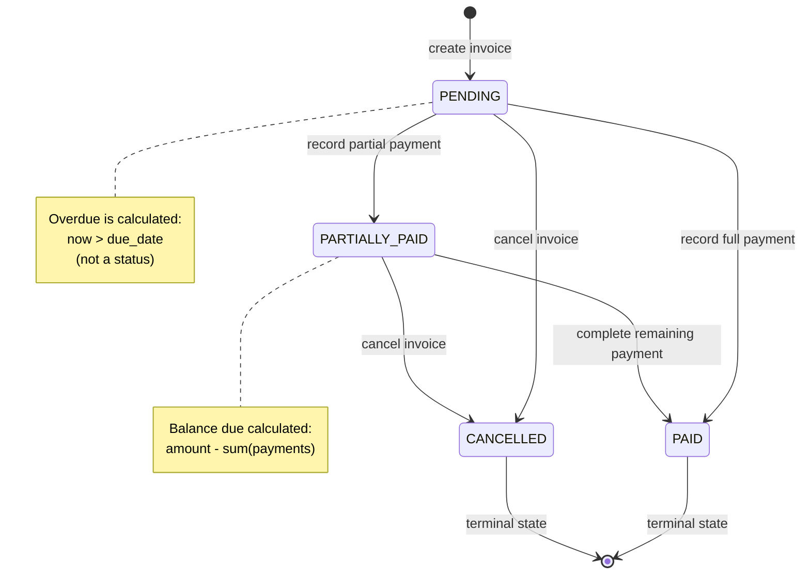

# ADR-002: Domain Model Design

## Status

Accepted

## Context

This ADR defines the core domain model for the Mattilda billing system. The system manages the billing lifecycle for educational institutions, including schools, students, invoices, and payments.

The domain must handle:

- **Financial correctness**: Exact monetary calculations for invoices, payments, and late fees
- **Partial payments**: Students can pay invoices in multiple installments
- **Late fee calculation**: Automatic fee assessment for overdue invoices
- **Account statements**: Aggregated financial summaries for students and schools
- **Audit trail**: Complete payment history for reconciliation

This ADR establishes the entities, value objects, business rules, and invariants that form the foundation of the system. These decisions are informed by:

- **ADR-001**: Project initialization standards (immutability, Clean Architecture, ABC ports)
- **Financial domain best practices**: UUID-based identifiers, Decimal arithmetic for monetary values, and value object patterns

The domain model prioritizes **correctness over convenience** and **explicitness over brevity**.

---

## Decision

### Core Invariants (Summary)

This ADR establishes the following non-negotiable invariants:

- **All entities are immutable**: Use `@dataclass(frozen=True, slots=True)` with copy-on-write pattern
- **All monetary values use Decimal**: NEVER float - exact decimal arithmetic throughout
- **All entity IDs are UUIDs**: Type-safe value objects with validation
- **Time is injected**: Domain never accesses clock directly
- **Partial payments allowed**: Multiple payments can be applied to a single invoice
- **Late fees calculated**: Overdue invoices accrue fees based on days past due date
- **Overdue is calculated**: No explicit status update - computed from due_date and current time

---

## 1. Monetary Values - Decimal Arithmetic System-Wide

### Status

**System-wide invariant** (non-negotiable)

### Scope

Applies to all monetary values in the billing system.

### Context

This system handles school billing including invoice amounts, payments, late fees, and account balances. Financial correctness is a **core business requirement** - schools, parents, and auditors expect exact monetary calculations.

The challenge: computers use binary floating-point arithmetic (IEEE 754), which cannot exactly represent decimal values. For example:

```python
0.1 + 0.2 == 0.30000000000000004  # True in Python
```

This creates problems in billing systems:

- **Rounding drift**: Repeated calculations accumulate errors
- **Non-deterministic totals**: Same inputs produce different outputs depending on operation order
- **Fragile tests**: Must use `assertAlmostEqual` instead of exact comparisons
- **Silent inaccuracies**: Off-by-one-cent errors that compound over time
- **Audit failures**: Cannot reproduce exact historical calculations

In a billing system calculating late fees over months with percentage rates, these errors can result in incorrect totals, failed audits, and parent complaints.

**This is a non-negotiable system invariant.**

### Canonical Rule

All monetary values in the system **must be represented and calculated using decimal arithmetic**, never floating-point numbers.

| Layer | Type | Rule |
|-------|------|------|
| Domain & Application | `Decimal` | All calculations use Python's `Decimal` type |
| Persistence (DB) | `NUMERIC(precision, scale)` | All monetary columns use PostgreSQL `NUMERIC` |
| External inputs (APIs) | `string` | Accept as string for precision |
| Boundary conversion | Immediate | Convert to `Decimal` at system boundary |
| Rounding | Explicit | Never implicit, documented per use case |

**No monetary value is allowed to exist as a `float` inside the domain or application layers.**

### What Counts as a Monetary Value

This rule applies to **any value that represents or affects money**:

- Invoice amounts (`Invoice.amount`)
- Payment amounts (`Payment.amount`)
- Late fees (`Invoice.late_fee_rate`, calculated late fee amounts)
- Account statement totals (total invoiced, total paid, total pending)
- Balance due (calculated: invoice amount - sum of payments)
- Any derived financial calculation

**Rule of thumb**: If it influences money → `Decimal`.

### Layer-Specific Rules

#### Domain & Application Layer

Use Python's `Decimal` type exclusively:

```python
from decimal import Decimal

# ✅ Correct - string literal constructor
amount = Decimal("1500.00")
rate = Decimal("0.05")  # 5% late fee

# ✅ Correct - integer constructor
cents = 150000
amount = Decimal(cents) / Decimal("100")

# ❌ Wrong - float constructor (precision loss)
amount = Decimal(1500.00)
amount = Decimal(15.99)  # Binary approximation
```

**Rules**:
- Never construct `Decimal` from a `float` directly
- Always use string literals for decimal values
- Use integer-based conversion when needed (e.g., cents → dollars)
- No `float` types in domain entities, value objects, or use case parameters

#### Database Layer

All monetary columns must use PostgreSQL `NUMERIC`:

```sql
NUMERIC(precision, scale)
```

**Examples**:

```sql
-- Invoice and payment amounts
amount: NUMERIC(12, 2)              -- $9,999,999,999.99 max

-- Late fee percentage rate
late_fee_rate: NUMERIC(5, 4)        -- 0.0000-9.9999 (0% to 999.99%)

-- Account balances (calculated, same precision as amounts)
balance_due: NUMERIC(12, 2)
```

**Guidelines**:
- `precision`: Total number of digits (12 allows up to $99 billion)
- `scale`: Decimal places (2 for currency, 4 for percentages/rates)
- Currency is not encoded at column level (application concern - all amounts in this system are assumed to be in the school's base currency)

#### Boundary Layer (APIs, Controllers)

External layers accept `string` for precision. Conversion happens immediately at the boundary:

```python
from decimal import Decimal

def to_decimal(value: str | int) -> Decimal:
    """
    Convert external input to Decimal at system boundary.
    
    Args:
        value: String representation or integer cents
        
    Returns:
        Decimal instance with exact value
        
    Raises:
        InvalidAmountError: If value cannot be parsed
    """
    try:
        return Decimal(str(value))
    except (ValueError, InvalidOperation) as e:
        raise InvalidAmountError(f"Invalid amount: {value}") from e
```

**After boundary conversion, `float` must not cross into**:
- Application layer (use cases)
- Domain entities
- Business rules
- Repository methods

#### Rounding Policy

Rounding is **never implicit** and must always be explicit and documented.

Every calculation performing monetary operations must define:
- **When** rounding occurs (at what step in the calculation)
- **How** rounding occurs (which rounding mode)

```python
from decimal import Decimal, ROUND_HALF_UP

# Explicit rounding to cents
amount = amount.quantize(Decimal("0.01"), rounding=ROUND_HALF_UP)
```

**Common patterns in this system**:
- **Payment amounts**: Rounded to 2 decimal places by client (validated on input)
- **Late fees**: Calculated with full precision, rounded once at the end
- **Account totals**: Computed precisely via SUM in database, no rounding needed
- **Balance due**: Exact subtraction (no rounding)

**Default rounding mode**: `ROUND_HALF_UP` (round 0.5 up to nearest integer, e.g., 2.5 → 3, -2.5 → -2)

**Note**: This is **not** "banker's rounding" (which would be `ROUND_HALF_EVEN`). We use `ROUND_HALF_UP` for simplicity and consistency with standard accounting practices in educational billing.

### Examples

#### Invoice Entity with Decimal

```python
from decimal import Decimal, ROUND_HALF_UP

@dataclass(frozen=True, slots=True)
class Invoice:
    """Invoice entity with exact monetary calculations."""
    id: InvoiceId
    student_id: StudentId
    amount: Decimal  # ✅ NEVER float
    late_fee_policy: LateFeePolicy  # Encapsulates late fee rules
    due_date: datetime
    
    def calculate_late_fee(self, now: datetime) -> Decimal:
        """
        Calculate late fee using policy.
        
        Delegates to LateFeePolicy to centralize business rule:
        "fees apply to ORIGINAL amount, not remaining balance".
        
        Args:
            now: Current timestamp (injected)
            
        Returns:
            Late fee amount, rounded to cents
        """
        if not self.is_overdue(now):
            return Decimal("0.00")
        
        return self.late_fee_policy.calculate_fee(
            original_amount=self.amount,
            due_date=self.due_date,
            now=now,
        )
```

**Example calculation**:
```python
invoice = Invoice(
    amount=Decimal("1500.00"),
    late_fee_policy=LateFeePolicy.standard(),  # 5% monthly
    due_date=datetime(2024, 1, 1, tzinfo=UTC),
    ...
)

# 15 days overdue
now = datetime(2024, 1, 16, tzinfo=UTC)
late_fee = invoice.calculate_late_fee(now)

# Policy calculates:
# monthly_fee = 1500.00 × 0.05 = 75.00
# daily_fee = 75.00 / 30 = 2.50
# total_fee = 2.50 × 15 = 37.50

assert late_fee == Decimal("37.50")  # ✅ Exact equality
```

#### Payment Validation

```python
@dataclass(frozen=True, slots=True)
class Payment:
    """Payment entity with validated Decimal amount."""
    id: PaymentId
    invoice_id: InvoiceId
    amount: Decimal  # ✅ Must be positive Decimal
    
    def __post_init__(self) -> None:
        """Validate amount at construction."""
        if not isinstance(self.amount, Decimal):
            raise InvalidAmountError(f"Amount must be Decimal, got {type(self.amount)}")
        
        if self.amount <= Decimal("0"):
            raise InvalidAmountError(f"Payment amount must be positive, got {self.amount}")
```

### Alternatives Considered

#### Use Floating-Point Everywhere

Use Python's native `float` type for all monetary calculations.

**Rejected**:
- Binary approximation causes precision loss
- Accumulating errors in multi-step calculations (late fee over 60 days)
- Non-deterministic behavior (operation order affects results)
- Fails regulatory/audit requirements for financial systems
- Tests become fragile (must use approximate equality)
- Example: `1500.00 * 0.05 * (15 / 30)` might yield `37.49999999999999`

#### Integer Cents Only

Store and calculate everything as integer cents (e.g., 150000 cents = $1500.00).

**Rejected**:
- Works for simple addition/subtraction
- Breaks down for division (late fee = 150000 × 0.05 × (15/30) = 3750 cents? or 3750.0?)
- Percentage calculations require careful handling of remainders
- Late fee rate of 5% = how many basis points? (500? 0.05? Unclear)
- More complex and error-prone than `Decimal`
- Doesn't solve the fundamental problem, just shifts it

#### Use Money Library (e.g., py-moneyed)

Use a third-party money library that handles currency and arithmetic.

**Deferred**:
- Adds external dependency
- Most Python money libraries use `Decimal` internally anyway
- Current needs are simple enough for direct `Decimal` usage
- No multi-currency support needed (single-currency billing)
- Can revisit if requirements change (international schools, FX conversion)
- Python's stdlib `Decimal` is battle-tested and sufficient

### Consequences

#### Positive

- **Correctness**: Exact decimal arithmetic, no precision loss
- **Deterministic**: Same inputs always produce same outputs
- **Auditable**: Can reproduce exact historical calculations
- **Testable**: Use exact equality assertions (`assert x == y`)
- **Regulatory compliance**: Meets financial industry standards
- **Long-term stability**: System remains correct as it scales
- **Developer confidence**: No "mystery" rounding errors

#### Negative

- **Verbosity**: `Decimal("1500.00")` vs `1500.00`
- **Learning curve**: Developers must understand `Decimal` API
- **Performance**: `Decimal` arithmetic is ~10x slower than `float` (acceptable trade-off for correctness)
- **API ergonomics**: Must serialize `Decimal` to string for JSON (not auto-convertible)

#### Neutral

- Requires explicit rounding decisions (forces intentionality - this is a good thing)
- Boundary conversion adds one step to input validation
- Database choice matters (PostgreSQL `NUMERIC` has excellent `Decimal` support)

### Enforcement

This is a **system invariant** enforced through:

1. **Code review**: Any `float` in monetary contexts is rejected
2. **Type hints**: Use `Decimal` in all monetary type signatures
3. **Tests**: Verify exact decimal behavior with `assert x == y`
4. **Domain validation**: `__post_init__` checks for `Decimal` type

**Violations are treated as design bugs, not style issues.**

---

## 2. Entity Identifiers (UUID Value Objects)

### Decision

All entities use **UUID-based value objects** for identifiers.

### Rationale

**Distributed generation**: IDs can be generated in application layer without database roundtrip. Entities have IDs immediately upon creation, enabling event emission, logging, and testing before persistence.

**Security**: UUIDs are non-enumerable. In a billing system, this prevents:
- Guessing other student/invoice IDs
- Discovering how many invoices exist
- Iterating through all records via incremental IDs

**Type safety**: Cannot accidentally pass wrong ID type (e.g., `StudentId` where `InvoiceId` expected). Type system enforces correctness at compile time.

**Testability**: Can create entities with known IDs in tests without database interaction.

### Pattern

```python
from __future__ import annotations
from dataclasses import dataclass
from uuid import UUID, uuid4

@dataclass(frozen=True, slots=True)
class InvoiceId:
    """
    Invoice identifier value object.
    
    Encapsulates UUID validation and ensures type safety.
    Immutable and hashable.
    """
    value: UUID
    
    def __post_init__(self) -> None:
        """Validate UUID type at construction."""
        if not isinstance(self.value, UUID):
            raise InvalidInvoiceIdError(
                f"Expected UUID, got {type(self.value).__name__}"
            )
    
    @classmethod
    def generate(cls) -> InvoiceId:
        """Generate new unique invoice ID."""
        return cls(value=uuid4())
    
    @classmethod
    def from_string(cls, id_str: str) -> InvoiceId:
        """
        Parse invoice ID from string representation.
        
        Args:
            id_str: UUID string (e.g., "550e8400-e29b-41d4-a716-446655440000")
            
        Returns:
            InvoiceId instance
            
        Raises:
            InvalidInvoiceIdError: If string is not a valid UUID
        """
        try:
            return cls(value=UUID(id_str))
        except (ValueError, AttributeError) as e:
            raise InvalidInvoiceIdError(f"Invalid UUID string: {id_str}") from e
    
    def __str__(self) -> str:
        """Return string representation for display/logging."""
        return str(self.value)
    
    def __repr__(self) -> str:
        """Return detailed representation for debugging."""
        return f"InvoiceId({self.value!r})"
```

### Identifiers

The system defines the following UUID-based identifiers:

- **`SchoolId`**: Identifies a school (educational institution)
- **`StudentId`**: Identifies a student enrolled in a school
- **`InvoiceId`**: Identifies a billing invoice issued to a student
- **`PaymentId`**: Identifies a payment made against an invoice

Each follows the same pattern as `InvoiceId` above.

### PostgreSQL Mapping

```python
# infrastructure/postgres/models/invoice_model.py
from sqlalchemy.dialects.postgresql import UUID as PG_UUID

class InvoiceModel(Base):
    __tablename__ = "invoices"
    
    # Native UUID type with automatic Python UUID conversion
    id: Mapped[UUID] = mapped_column(
        PG_UUID(as_uuid=True),
        primary_key=True
    )
    
    student_id: Mapped[UUID] = mapped_column(
        PG_UUID(as_uuid=True),
        ForeignKey("students.id", ondelete="RESTRICT"),
        nullable=False,
        index=True
    )
```

### Mapper Pattern

```python
# infrastructure/postgres/mappers/invoice_mapper.py
class InvoiceMapper:
    """Maps between Invoice entity and InvoiceModel ORM."""
    
    @staticmethod
    def to_entity(model: InvoiceModel) -> Invoice:
        """Convert ORM model to domain entity."""
        return Invoice(
            id=InvoiceId(value=model.id),  # UUID → Value Object
            student_id=StudentId(value=model.student_id),
            amount=Decimal(str(model.amount)),  # NUMERIC → Decimal
            # ... rest of fields
        )
    
    @staticmethod
    def to_model(entity: Invoice) -> InvoiceModel:
        """Convert domain entity to ORM model."""
        return InvoiceModel(
            id=entity.id.value,  # Value Object → UUID
            student_id=entity.student_id.value,
            amount=entity.amount,  # Decimal → NUMERIC (SQLAlchemy handles)
            # ... rest of fields
        )
```

### Usage Example

```python
# Generate ID in domain
invoice_id = InvoiceId.generate()

# Use in entity creation
invoice = Invoice.create(
    id=invoice_id,  # Has ID before persistence
    student_id=student_id,
    amount=Decimal("1500.00"),
    ...
)

# Log with ID immediately (no DB save needed yet)
logger.info(f"Creating invoice {invoice_id}")

# Save to database
await invoice_repo.save(invoice)

# Parse from API
invoice_id = InvoiceId.from_string(request.invoice_id)
```

### Alternatives Considered

#### Integer Auto-Increment IDs

Use database sequences for ID generation (e.g., `id SERIAL PRIMARY KEY`).

**Rejected**:
- Requires database roundtrip to get ID
- Entities don't have IDs until after persistence
- Security issue: IDs are enumerable (can guess invoice 1, 2, 3...)
- Reveals business information (number of invoices)
- Difficult to test (need DB or mock ID generation)
- Merge conflicts in distributed scenarios

#### String-Based IDs (e.g., "INV-2024-001")

Use human-readable string identifiers.

**Rejected**:
- Not globally unique (requires coordination for uniqueness)
- Harder to generate without collisions
- Type safety issues (just a string, easy to confuse types)
- Still enumerable (sequential numbers visible)
- Larger storage footprint than UUID for same guarantees

**Note**: Human-readable invoice numbers (e.g., "INV-2024-001") are supported as a **separate field** (`invoice_number: str`), not as the primary identifier.

---

## 3. Core Entities

### 3.1 School

```python
@dataclass(frozen=True, slots=True)
class School:
    """
    School entity representing an educational institution.
    
    Immutable. Changes return new instances via copy-on-write.
    """
    id: SchoolId
    name: str
    address: str
    created_at: datetime
    
    def __post_init__(self) -> None:
        """Validate invariants at construction."""
        if not self.name or not self.name.strip():
            raise InvalidSchoolDataError("School name cannot be empty")
        
        if not self.address or not self.address.strip():
            raise InvalidSchoolDataError("School address cannot be empty")
        
        if self.created_at.tzinfo != UTC:
            raise InvalidSchoolDataError(
                f"Created timestamp must have UTC timezone, got {self.created_at.tzinfo}"
            )
    
    @classmethod
    def create(cls, name: str, address: str, now: datetime) -> School:
        """
        Create new school with generated ID.
        
        Args:
            name: School name
            address: School address
            now: Current timestamp (injected)
            
        Returns:
            New school instance
        """
        return cls(
            id=SchoolId.generate(),
            name=name.strip(),
            address=address.strip(),
            created_at=now,
        )
```

**Attributes**:
- `id`: Unique school identifier (UUID)
- `name`: School name (non-empty)
- `address`: School physical address (non-empty)
- `created_at`: Timestamp when school was created (UTC)

**Invariants**:
- School name must not be empty (after trimming whitespace)
- School address must not be empty (after trimming whitespace)
- `created_at` must have UTC timezone

**Relationships**:
- **School → Student**: One-to-many (a school has many students)

---

### 3.2 Student

```python
@dataclass(frozen=True, slots=True)
class Student:
    """
    Student entity representing an individual enrolled in a school.
    
    Relationship with school is immutable (1:1).
    Immutable. Changes return new instances via copy-on-write.
    """
    id: StudentId
    school_id: SchoolId  # Immutable - never changes after enrollment
    first_name: str
    last_name: str
    email: str
    enrollment_date: datetime
    status: StudentStatus
    created_at: datetime
    updated_at: datetime
    
    def __post_init__(self) -> None:
        """Validate invariants at construction."""
        if not self.first_name or not self.first_name.strip():
            raise InvalidStudentDataError("First name cannot be empty")
        
        if not self.last_name or not self.last_name.strip():
            raise InvalidStudentDataError("Last name cannot be empty")
        
        # Basic email validation (not RFC-compliant, but catches obvious errors)
        if not self.email or "@" not in self.email or "." not in self.email.split("@")[-1]:
            raise InvalidStudentDataError(
                f"Invalid email format: {self.email}"
            )
        
        if self.enrollment_date.tzinfo != UTC:
            raise InvalidStudentDataError(
                f"Enrollment date must have UTC timezone, got {self.enrollment_date.tzinfo}"
            )
        
        if self.created_at.tzinfo != UTC:
            raise InvalidStudentDataError(
                f"Created timestamp must have UTC timezone, got {self.created_at.tzinfo}"
            )
        
        if self.updated_at.tzinfo != UTC:
            raise InvalidStudentDataError(
                f"Updated timestamp must have UTC timezone, got {self.updated_at.tzinfo}"
            )
    
    @classmethod
    def create(
        cls,
        school_id: SchoolId,
        first_name: str,
        last_name: str,
        email: str,
        now: datetime,
    ) -> Student:
        """
        Create new student enrolled in a school.
        
        Args:
            school_id: School where student is enrolled
            first_name: Student's first name
            last_name: Student's last name
            email: Student's email address
            now: Current timestamp (injected)
            
        Returns:
            New student instance with ACTIVE status
        """
        return cls(
            id=StudentId.generate(),
            school_id=school_id,
            first_name=first_name.strip(),
            last_name=last_name.strip(),
            email=email.strip().lower(),
            enrollment_date=now,
            status=StudentStatus.ACTIVE,
            created_at=now,
            updated_at=now,
        )
    
    def deactivate(self, now: datetime) -> Student:
        """
        Return new student with status INACTIVE.
        
        Args:
            now: Current timestamp (injected)
            
        Returns:
            New student instance with INACTIVE status
        """
        return replace(self, status=StudentStatus.INACTIVE, updated_at=now)
    
    def graduate(self, now: datetime) -> Student:
        """
        Return new student with status GRADUATED.
        
        Args:
            now: Current timestamp (injected)
            
        Returns:
            New student instance with GRADUATED status
        """
        return replace(self, status=StudentStatus.GRADUATED, updated_at=now)
    
    @property
    def full_name(self) -> str:
        """Return student's full name."""
        return f"{self.first_name} {self.last_name}"
```

**Attributes**:
- `id`: Unique student identifier (UUID)
- `school_id`: School where student is enrolled (IMMUTABLE)
- `first_name`: Student's first name (non-empty)
- `last_name`: Student's last name (non-empty)
- `email`: Student's email address (validated)
- `enrollment_date`: When student enrolled (UTC)
- `status`: Current enrollment status (enum)
- `created_at`: When student record was created (UTC)
- `updated_at`: Last modification timestamp (UTC)

**Invariants**:
- First name must not be empty
- Last name must not be empty
- Email must contain "@" (basic validation)
- `school_id` is immutable - a student cannot transfer schools in this system
- All timestamps must have UTC timezone

**Relationships**:
- **Student → School**: Many-to-one (a student belongs to one school)
- **Student → Invoice**: One-to-many (a student has many invoices)

**Design Decision**: The `school_id` is **immutable**. A student is permanently associated with one school. Student transfers between schools are out of scope for this challenge.

---

### 3.3 Invoice

```python
@dataclass(frozen=True, slots=True)
class Invoice:
    """
    Invoice entity representing a billing invoice issued to a student.
    
    Supports partial payments (multiple Payment entities can reference this invoice).
    
    **Status management**: Status is STORED (not calculated). Use cases are responsible
    for updating status when payments are recorded. The domain entity validates that
    transitions are legal, but does not calculate the new status—that's the use case's job.
    
    **Late fees**: Calculated via LateFeePolicy value object, which encapsulates the
    "original amount vs balance" business rule.
    
    Immutable. Changes return new instances via copy-on-write.
    """
    id: InvoiceId
    student_id: StudentId
    invoice_number: str  # Human-readable: "INV-2024-001"
    amount: Decimal  # Total amount to be paid (NEVER float)
    due_date: datetime
    description: str
    late_fee_policy: LateFeePolicy  # Encapsulates late fee calculation
    status: InvoiceStatus
    created_at: datetime
    updated_at: datetime
    
    def __post_init__(self) -> None:
        """Validate invariants at construction."""
        # Check type FIRST, before any comparisons
        if not isinstance(self.amount, Decimal):
            raise InvalidInvoiceAmountError(
                f"Invoice amount must be Decimal, got {type(self.amount).__name__}"
            )
        
        if self.amount <= Decimal("0"):
            raise InvalidInvoiceAmountError(
                f"Invoice amount must be positive, got {self.amount}"
            )
        
        if not self.invoice_number or not self.invoice_number.strip():
            raise InvalidInvoiceDataError("Invoice number cannot be empty")
        
        if not self.description or not self.description.strip():
            raise InvalidInvoiceDataError("Invoice description cannot be empty")
        
        # UTC validation via reusable guard (see Section 4.4)
        validate_utc_timestamp(self.due_date, "due_date")
        validate_utc_timestamp(self.created_at, "created_at")
        validate_utc_timestamp(self.updated_at, "updated_at")
        
        if self.due_date < self.created_at:
            raise InvalidInvoiceDataError(
                f"Due date {self.due_date} cannot be before creation {self.created_at}"
            )
    
    @classmethod
    def create(
        cls,
        student_id: StudentId,
        amount: Decimal,
        due_date: datetime,
        description: str,
        late_fee_policy: LateFeePolicy,
        now: datetime,
    ) -> Invoice:
        """
        Create new invoice with generated ID and invoice number.
        
        Args:
            student_id: Student being invoiced
            amount: Total invoice amount (must be positive Decimal)
            due_date: Payment due date
            description: Invoice description/concept
            late_fee_policy: Policy for late fee calculation
            now: Current timestamp (injected)
            
        Returns:
            New invoice with PENDING status
        """
        return cls(
            id=InvoiceId.generate(),
            student_id=student_id,
            invoice_number=cls._generate_invoice_number(now),
            amount=amount,
            due_date=due_date,
            description=description.strip(),
            late_fee_policy=late_fee_policy,
            status=InvoiceStatus.PENDING,
            created_at=now,
            updated_at=now,
        )
    
    @staticmethod
    def _generate_invoice_number(now: datetime) -> str:
        """
        Generate human-readable invoice number.
        
        Format: INV-YYYY-NNNNNN (e.g., INV-2024-000001)
        
        **IMPORTANT**: This is a DECORATIVE field for human readability only.
        Uniqueness is NOT guaranteed—timestamp-based suffix can collide under load
        or across multiple application instances.
        
        The UUID `id` field is the true unique identifier.
        
        **Production implementation**: Replace with DB-backed sequence per school/year:
        ```sql
        SELECT COALESCE(MAX(CAST(SUBSTRING(invoice_number FROM 10) AS INTEGER)), 0) + 1
        FROM invoices
        WHERE invoice_number LIKE 'INV-2024-%'
        ```
        
        For this challenge, we accept potential collisions and treat invoice_number
        as display-only.
        """
        year = now.year
        # Timestamp-based suffix (NOT UNIQUE - may collide)
        timestamp_suffix = int(now.timestamp() * 1000) % 1000000
        return f"INV-{year}-{timestamp_suffix:06d}"
    
    def is_overdue(self, now: datetime) -> bool:
        """
        Check if invoice is overdue (calculated, not stored).
        
        An invoice is overdue if:
        - Current time is past due date AND
        - Status is PENDING or PARTIALLY_PAID
        
        Args:
            now: Current timestamp (injected)
            
        Returns:
            True if invoice is overdue
        """
        return (
            now > self.due_date
            and self.status in [InvoiceStatus.PENDING, InvoiceStatus.PARTIALLY_PAID]
        )
    
    def calculate_late_fee(self, now: datetime) -> Decimal:
        """
        Calculate late fee using policy.
        
        Delegates to LateFeePolicy to ensure consistent calculation
        and centralize "original amount vs balance" business rule.
        
        Args:
            now: Current timestamp (injected)
            
        Returns:
            Late fee amount (Decimal, rounded to cents)
            Returns Decimal("0.00") if not overdue
        """
        if not self.is_overdue(now):
            return Decimal("0.00")
        
        return self.late_fee_policy.calculate_fee(
            original_amount=self.amount,  # Explicitly ORIGINAL amount
            due_date=self.due_date,
            now=now,
        )
    
    def update_status(self, new_status: InvoiceStatus, now: datetime) -> Invoice:
        """
        Return new invoice with updated status.
        
        Validates state transitions are legal.
        
        Args:
            new_status: Target status
            now: Current timestamp (injected)
            
        Returns:
            New invoice instance with updated status
            
        Raises:
            InvalidStateTransitionError: If transition is not allowed
        """
        # Validate transition
        if not self._is_valid_transition(self.status, new_status):
            raise InvalidStateTransitionError(
                f"Cannot transition from {self.status} to {new_status}"
            )
        
        return replace(self, status=new_status, updated_at=now)
    
    def cancel(self, now: datetime) -> Invoice:
        """
        Return new invoice with status CANCELLED.
        
        Args:
            now: Current timestamp (injected)
            
        Returns:
            New invoice with CANCELLED status
            
        Raises:
            InvalidStateTransitionError: If invoice is already PAID
        """
        if self.status == InvoiceStatus.PAID:
            raise InvalidStateTransitionError("Cannot cancel paid invoice")
        
        return replace(self, status=InvoiceStatus.CANCELLED, updated_at=now)
    
    @staticmethod
    def _is_valid_transition(current: InvoiceStatus, target: InvoiceStatus) -> bool:
        """
        Check if status transition is valid.
        
        Valid transitions:
        - PENDING → PARTIALLY_PAID, PAID, CANCELLED
        - PARTIALLY_PAID → PAID, CANCELLED
        - PAID → (terminal, no transitions)
        - CANCELLED → (terminal, no transitions)
        """
        if current == target:
            return True  # Same status is always allowed
        
        allowed_transitions = {
            InvoiceStatus.PENDING: {
                InvoiceStatus.PARTIALLY_PAID,
                InvoiceStatus.PAID,
                InvoiceStatus.CANCELLED,
            },
            InvoiceStatus.PARTIALLY_PAID: {
                InvoiceStatus.PAID,
                InvoiceStatus.CANCELLED,
            },
            InvoiceStatus.PAID: set(),  # Terminal
            InvoiceStatus.CANCELLED: set(),  # Terminal
        }
        
        return target in allowed_transitions.get(current, set())
```

**Attributes**:
- `id`: Unique invoice identifier (UUID)
- `student_id`: Student being invoiced (foreign key)
- `invoice_number`: Human-readable invoice number (e.g., "INV-2024-000001")
- `amount`: Total invoice amount (Decimal, always positive)
- `due_date`: Payment deadline (UTC timestamp)
- `description`: Invoice description/concept (e.g., "January 2024 Tuition")
- `late_fee_rate`: Monthly late fee percentage (Decimal, 0.0 to 1.0)
- `status`: Current payment status (enum)
- `created_at`: When invoice was created (UTC)
- `updated_at`: Last modification timestamp (UTC)

**Invariants**:
- `amount` > 0 and must be `Decimal` type
- `late_fee_rate` between 0 and 1 (0% to 100%)
- `invoice_number` must not be empty
- `description` must not be empty
- `due_date` >= `created_at`
- All timestamps must have UTC timezone

**Calculated Fields** (not stored):
- `is_overdue(now)`: Computed from `due_date` and current status
- `calculate_late_fee(now)`: Computed from amount, rate, and days overdue
- `balance_due`: Computed in repository (sum of payments)

**Relationships**:
- **Invoice → Student**: Many-to-one (many invoices belong to one student)
- **Invoice → Payment**: One-to-many (one invoice can have many payments)

---

### 3.4 Payment

```python
@dataclass(frozen=True, slots=True)
class Payment:
    """
    Payment entity representing a monetary transaction against an invoice.
    
    Immutable and append-only (cannot be modified after creation).
    Multiple payments can be applied to a single invoice (partial payments).
    """
    id: PaymentId
    invoice_id: InvoiceId
    amount: Decimal  # Payment amount (NEVER float)
    payment_date: datetime  # When payment was made (not when recorded)
    payment_method: str  # e.g., "cash", "bank_transfer", "card"
    reference_number: str | None  # External reference (e.g., transaction ID)
    created_at: datetime  # When payment was recorded in system
    
    def __post_init__(self) -> None:
        """Validate invariants at construction."""
        # Check type FIRST, before any comparisons
        if not isinstance(self.amount, Decimal):
            raise InvalidPaymentAmountError(
                f"Payment amount must be Decimal, got {type(self.amount).__name__}"
            )
        
        if self.amount <= Decimal("0"):
            raise InvalidPaymentAmountError(
                f"Payment amount must be positive, got {self.amount}"
            )
        
        if not self.payment_method or not self.payment_method.strip():
            raise InvalidPaymentDataError("Payment method cannot be empty")
        
        if self.payment_date.tzinfo != UTC:
            raise InvalidPaymentDataError(
                f"Payment date must have UTC timezone, got {self.payment_date.tzinfo}"
            )
        
        if self.created_at.tzinfo != UTC:
            raise InvalidPaymentDataError(
                f"Created timestamp must have UTC timezone, got {self.created_at.tzinfo}"
            )
    
    @classmethod
    def create(
        cls,
        invoice_id: InvoiceId,
        amount: Decimal,
        payment_date: datetime,
        payment_method: str,
        reference_number: str | None,
        now: datetime,
    ) -> Payment:
        """
        Create new payment record.
        
        Args:
            invoice_id: Invoice this payment applies to
            amount: Payment amount (must be positive Decimal)
            payment_date: When payment was made (may be in past)
            payment_method: How payment was made
            reference_number: External reference (optional)
            now: Current timestamp (when recording payment)
            
        Returns:
            New payment instance
        """
        return cls(
            id=PaymentId.generate(),
            invoice_id=invoice_id,
            amount=amount,
            payment_date=payment_date,
            payment_method=payment_method.strip(),
            reference_number=reference_number.strip() if reference_number else None,
            created_at=now,
        )
```

**Attributes**:
- `id`: Unique payment identifier (UUID)
- `invoice_id`: Invoice this payment applies to (foreign key)
- `amount`: Payment amount (Decimal, always positive)
- `payment_date`: When payment was actually made (may differ from `created_at`)
- `payment_method`: How payment was made (e.g., "cash", "bank_transfer")
- `reference_number`: External reference number (optional, e.g., bank transaction ID)
- `created_at`: When payment was recorded in system (UTC)

**Invariants**:
- `amount` > 0 and must be `Decimal` type
- `payment_method` must not be empty
- Payments are **immutable** - cannot be modified after creation
- If modifying a payment is needed, create a new payment with opposite amount (reversal pattern)

**Relationships**:
- **Payment → Invoice**: Many-to-one (many payments belong to one invoice)

**Design Decision**: Payments are **append-only**. Payments cannot be modified or deleted after creation.

**Payment reversals**: If a payment needs to be reversed (e.g., bounced check, refund), this must be handled explicitly:
- **Option A** (recommended): Create a separate `PaymentReversal` entity that references the original payment
- **Option B**: Business process outside the domain (manual adjustment, negative invoice)

**Current scope**: Payment reversals are **out of scope** for this challenge. The domain enforces positive amounts only. Future ADR will define reversal semantics if needed.

**Audit trail**: The append-only nature ensures complete payment history is preserved.

---

## 4. Value Objects

### 4.1 InvoiceStatus (Enum)

```python
from enum import Enum

class InvoiceStatus(str, Enum):
    """
    Invoice payment status.
    
    Inherits from str for JSON serialization.
    """
    PENDING = "pending"              # No payments received yet
    PARTIALLY_PAID = "partially_paid"  # Some payments received, balance remaining
    PAID = "paid"                    # Fully paid (sum of payments = amount)
    CANCELLED = "cancelled"          # Invoice cancelled (no payment expected)
    
    def __str__(self) -> str:
        """Return string value for display."""
        return self.value
```

**States**:
- `PENDING`: Invoice created, no payments yet
- `PARTIALLY_PAID`: At least one payment received, but sum(payments) < amount
- `PAID`: Fully paid, sum(payments) == amount
- `CANCELLED`: Invoice cancelled (will not be paid)

**Transitions**:
```
PENDING → PARTIALLY_PAID  (first partial payment)
PENDING → PAID            (full payment at once)
PENDING → CANCELLED       (cancel before payment)

PARTIALLY_PAID → PAID     (final payment completes invoice)
PARTIALLY_PAID → CANCELLED (cancel partially paid invoice)

PAID → (terminal, no transitions)
CANCELLED → (terminal, no transitions)
```

**Note**: `OVERDUE` is **not a status** - it is calculated from `due_date` and current time. An invoice can be both `PENDING` and overdue, or `PARTIALLY_PAID` and overdue.

---

### 4.2 StudentStatus (Enum)

```python
class StudentStatus(str, Enum):
    """
    Student enrollment status.
    
    Inherits from str for JSON serialization.
    """
    ACTIVE = "active"          # Currently enrolled and attending
    INACTIVE = "inactive"      # Not currently attending (temporary)
    GRADUATED = "graduated"    # Completed studies
    
    def __str__(self) -> str:
        """Return string value for display."""
        return self.value
```

**States**:
- `ACTIVE`: Student is currently enrolled and attending
- `INACTIVE`: Student temporarily not attending (e.g., leave of absence)
- `GRADUATED`: Student completed their studies

**Transitions**:
```
ACTIVE → INACTIVE    (student takes leave)
ACTIVE → GRADUATED   (student completes studies)

INACTIVE → ACTIVE    (student returns)
INACTIVE → GRADUATED (student completes while on leave)

GRADUATED → (terminal, no transitions)
```

---

### 4.3 LateFeePolicy (Value Object)

```python
from decimal import Decimal, ROUND_HALF_UP

@dataclass(frozen=True, slots=True)
class LateFeePolicy:
    """
    Late fee calculation policy.
    
    Encapsulates business rules for late fee calculation in a testable,
    reusable value object. This ensures the "original amount vs balance"
    rule is encoded once and consistent across the domain.
    """
    monthly_rate: Decimal  # e.g., Decimal("0.05") = 5% per month
    
    def __post_init__(self) -> None:
        """Validate policy parameters."""
        if not isinstance(self.monthly_rate, Decimal):
            raise InvalidLateFeeRateError(
                f"Monthly rate must be Decimal, got {type(self.monthly_rate).__name__}"
            )
        
        if self.monthly_rate < Decimal("0") or self.monthly_rate > Decimal("1"):
            raise InvalidLateFeeRateError(
                f"Monthly rate must be between 0 and 1, got {self.monthly_rate}"
            )
    
    def calculate_fee(
        self, 
        original_amount: Decimal, 
        due_date: datetime, 
        now: datetime
    ) -> Decimal:
        """
        Calculate late fee for an overdue invoice.
        
        **Business Rule**: Fee is based on ORIGINAL invoice amount,
        NOT the remaining balance due. This rule is encoded here once
        and reused consistently.
        
        Formula: original_amount × monthly_rate × (days_overdue / 30)
        
        Args:
            original_amount: Original invoice amount (not balance due)
            due_date: Invoice due date (must have UTC timezone)
            now: Current timestamp (must have UTC timezone, injected)
            
        Returns:
            Late fee amount (Decimal, rounded to cents)
            Returns Decimal("0.00") if not overdue
            
        Raises:
            InvalidTimestampError: If timestamps lack UTC timezone
        """
        # Validate UTC (defensive, should be caught earlier)
        validate_utc_timestamp(due_date, "due_date")
        validate_utc_timestamp(now, "now")
        
        if now <= due_date:
            return Decimal("0.00")
        
        days_overdue = (now.date() - due_date.date()).days
        
        # Monthly late fee based on ORIGINAL amount
        monthly_fee = original_amount * self.monthly_rate
        
        # Daily proration (30 days per month)
        daily_fee = monthly_fee / Decimal("30")
        
        # Total fee for days overdue
        total_fee = daily_fee * Decimal(str(days_overdue))
        
        # Explicit rounding to cents
        return total_fee.quantize(Decimal("0.01"), rounding=ROUND_HALF_UP)
    
    @classmethod
    def standard(cls) -> LateFeePolicy:
        """Factory method for standard 5% monthly late fee policy."""
        return cls(monthly_rate=Decimal("0.05"))
    
    @classmethod
    def no_late_fees(cls) -> LateFeePolicy:
        """Factory method for no late fee policy (0%)."""
        return cls(monthly_rate=Decimal("0.00"))
```

**Rationale**:
- **Single source of truth**: "Original amount vs balance" rule encoded once
- **Testable in isolation**: Can test policy without creating invoices
- **Reusable**: Same policy used by Invoice, account statements, reporting
- **Clear semantics**: Business rule lives in dedicated value object
- **Type safe**: Enforces Decimal arithmetic
- **Extensible**: Different policies per school/invoice type in future

**Usage in Invoice**:
```python
@dataclass(frozen=True, slots=True)
class Invoice:
    # ... other fields
    late_fee_policy: LateFeePolicy  # Encapsulates calculation rules
    
    def calculate_late_fee(self, now: datetime) -> Decimal:
        """
        Calculate late fee using policy.
        
        Delegates to LateFeePolicy to ensure consistent calculation.
        """
        if not self.is_overdue(now):
            return Decimal("0.00")
        
        return self.late_fee_policy.calculate_fee(
            original_amount=self.amount,  # Explicitly ORIGINAL amount
            due_date=self.due_date,
            now=now,
        )
```

**Benefits**:
- Invoice no longer knows late fee formula details
- Policy can be tested independently with various scenarios
- Different policies can be applied per school/invoice type
- "Original amount" rule is explicit in policy signature
- Formula changes (e.g., grace days, different proration) localized to policy

---

### 4.4 UTC Timestamp Validation (Guard Function)

To ensure consistent UTC validation across all entities and avoid drift as new entities are added, we define a reusable validation guard:

```python
from datetime import datetime, UTC

def validate_utc_timestamp(dt: datetime, field_name: str) -> None:
    """
    Validate that datetime has UTC timezone.
    
    **Hard invariant**: All datetimes in the domain MUST have UTC timezone.
    See ADR-003 (Time Provider) for complete policy.
    
    Args:
        dt: Datetime to validate
        field_name: Field name for error message
        
    Raises:
        InvalidTimestampError: If datetime is naive or non-UTC
        
    Example:
        >>> validate_utc_timestamp(datetime.now(UTC), "created_at")  # OK
        >>> validate_utc_timestamp(datetime.now(), "created_at")  # Raises
    """
    if dt.tzinfo is None:
        raise InvalidTimestampError(
            f"{field_name} must be timezone-aware, got naive datetime: {dt}"
        )
    
    if dt.tzinfo != UTC:
        raise InvalidTimestampError(
            f"{field_name} must have UTC timezone, got {dt.tzinfo}: {dt}"
        )
```

**Usage in entities**:
```python
@dataclass(frozen=True, slots=True)
class Invoice:
    created_at: datetime
    updated_at: datetime
    due_date: datetime
    
    def __post_init__(self) -> None:
        """Validate invariants at construction."""
        # UTC validation via reusable guard
        validate_utc_timestamp(self.created_at, "created_at")
        validate_utc_timestamp(self.updated_at, "updated_at")
        validate_utc_timestamp(self.due_date, "due_date")
        
        # ... other validations
```

**Benefits**:
- **Single source of truth**: UTC validation logic in one place
- **Consistent error messages**: Same format across all entities
- **Easier to update**: Change validation logic once
- **References ADR-003**: Explicit link to time provider policy
- **Prevents drift**: New entities automatically use same guard

**Testing**:
```python
def test_validate_utc_timestamp_rejects_naive():
    """Test guard rejects naive datetime."""
    naive = datetime(2024, 1, 1, 12, 0, 0)  # No timezone
    
    with pytest.raises(InvalidTimestampError) as exc:
        validate_utc_timestamp(naive, "created_at")
    
    assert "must be timezone-aware" in str(exc.value)

def test_validate_utc_timestamp_rejects_non_utc():
    """Test guard rejects non-UTC timezone."""
    from zoneinfo import ZoneInfo
    eastern = datetime(2024, 1, 1, 12, 0, 0, tzinfo=ZoneInfo("America/New_York"))
    
    with pytest.raises(InvalidTimestampError) as exc:
        validate_utc_timestamp(eastern, "created_at")
    
    assert "must have UTC timezone" in str(exc.value)
```

**Cross-reference**: See [ADR-003: Time Provider](ADR-003-time-provider.md) for complete UTC policy and time injection semantics.

---

## 5. Invoice State Machine

The invoice status follows a well-defined state machine:



**Terminal States**: `PAID` and `CANCELLED` - no further transitions allowed.

**Overdue Handling**: Overdue is a **calculated condition**, not a status. An invoice can be `PENDING` and overdue, or `PARTIALLY_PAID` and overdue. The system calculates late fees based on this condition.

---

## 6. Business Rules (Invariants)

### 6.1 Invoice Rules

1. **Amount must be Decimal type** (checked BEFORE comparisons):
   ```python
   if not isinstance(invoice.amount, Decimal):
       raise InvalidInvoiceAmountError(...)
   ```

2. **Amount must be positive**:
   ```python
   if invoice.amount <= Decimal("0"):
       raise InvalidInvoiceAmountError(...)
   ```

3. **All timestamps must have UTC timezone**:
   ```python
   if invoice.created_at.tzinfo != UTC:
       raise InvalidInvoiceDataError(...)
   if invoice.updated_at.tzinfo != UTC:
       raise InvalidInvoiceDataError(...)
   if invoice.due_date.tzinfo != UTC:
       raise InvalidInvoiceDataError(...)
   ```

4. **Due date must be after creation date**:
   ```python
   if invoice.due_date < invoice.created_at:
       raise InvalidInvoiceDataError(...)
   ```

4. **Sum of payments cannot exceed invoice amount**:
   ```python
   # Validated in use case before creating payment
   if total_paid + new_payment.amount > invoice.amount:
       raise PaymentExceedsInvoiceAmountError(...)
   ```

5. **Cannot pay cancelled invoice**:
   ```python
   if invoice.status == InvoiceStatus.CANCELLED:
       raise CannotPayCancelledInvoiceError(...)
   ```

6. **Overdue is calculated, not stored**:
   ```python
   def is_overdue(self, now: datetime) -> bool:
       return (
           now > self.due_date
           and self.status in [InvoiceStatus.PENDING, InvoiceStatus.PARTIALLY_PAID]
       )
   ```

7. **Late fee rate must be between 0 and 1**:
   ```python
   if not (Decimal("0") <= late_fee_rate <= Decimal("1")):
       raise InvalidLateFeeRateError(...)
   ```

### 6.2 Payment Rules

1. **Amount must be positive**:
   ```python
   if payment.amount <= Decimal("0"):
       raise InvalidPaymentAmountError(...)
   ```

2. **Amount must be Decimal type**:
   ```python
   if not isinstance(payment.amount, Decimal):
       raise InvalidPaymentAmountError(...)
   ```

3. **Amount cannot exceed invoice balance due**:
   ```python
   # Validated in use case (requires calculating current balance)
   balance_due = invoice.amount - sum(existing_payments)
   if payment.amount > balance_due:
       raise PaymentExceedsBalanceError(...)
   ```

4. **Payments are immutable**:
   - Cannot modify payment after creation
   - To "cancel" a payment, create reversal entry

5. **Payment method must not be empty**:
   ```python
   if not payment.payment_method.strip():
       raise InvalidPaymentDataError(...)
   ```

### 6.3 Late Fee Rules

**Business Rule**: Late fees are calculated as a percentage of the **original invoice amount** (not the remaining balance due). This is a deliberate business decision.

**Rationale**: Late fees penalize late payment of the entire invoice, not just the unpaid portion. If a student pays $500 of a $1500 invoice late, they still owe late fees on the full $1500.

**Formula**: `late_fee = invoice.amount × late_fee_rate × (days_overdue / 30)`

**Proration**: Monthly rate is prorated by dividing days overdue by 30. This is approximate (not all months have 30 days) but simple and predictable.

**Calculation timing**:
1. **Grace period**: Late fees begin accruing immediately after `due_date` (no grace days in this model)
2. **Days overdue**: Calculated as `(current_date - due_date).days`
3. **Rounding**: Late fees are rounded to cents using `ROUND_HALF_UP`

**Edge cases**:
- **Partial payments**: Do NOT reduce late fee calculation base (fees apply to original amount)
- **Multiple payments**: Late fee accumulates continuously; not recalculated per payment
- **Overpayment**: Late fees calculated before overpayment check (pay the fee even if you overpay)

**Example scenarios**:

**Scenario 1**: Student pays full invoice late
```python
invoice = Invoice(amount=Decimal("1500.00"), late_fee_rate=Decimal("0.05"), ...)
# 15 days overdue
late_fee = invoice.calculate_late_fee(now)  # 1500 × 0.05 × (15/30) = $37.50
# Student owes: $1500 + $37.50 = $1537.50
```

**Scenario 2**: Student makes partial payment on time, completes late
```python
# Payment 1: $500 on time (no late fee yet)
# Payment 2: $1000 15 days late
late_fee = invoice.calculate_late_fee(now)  # 1500 × 0.05 × (15/30) = $37.50
# Late fee still based on $1500 (original amount), not $1000 (remaining balance)
```

**Scenario 3**: Invoice fully paid before due date
```python
if invoice.status == InvoiceStatus.PAID:
    late_fee = Decimal("0.00")  # No late fee if paid on time
```

**Implementation note**: Late fees are calculated on-demand (not stored). This ensures they're always current and avoids stale data. The use case that generates account statements or invoices queries the current late fee amount.

1. **Only applied when overdue**:
   ```python
   if not invoice.is_overdue(now):
       return Decimal("0.00")
   ```

2. **Late fees use Decimal precision**:
   ```python
   late_fee = (amount * rate * days / 30).quantize(
       Decimal("0.01"), rounding=ROUND_HALF_UP
   )
   ```

3. **Late fees are prorated daily**:
   - Monthly rate divided by 30 days
   - Multiplied by days overdue
   - Example: 15 days overdue on $1500 at 5% monthly = $37.50

4. **Late fees round to cents**:
   - Always use `ROUND_HALF_UP` mode
   - Explicit rounding at the end of calculation

### 6.4 Student-School Rules

1. **Student-School relationship is immutable**:
   ```python
   # school_id cannot change after student creation
   # This is enforced by frozen dataclass
   ```

2. **Student must have valid email**:
   ```python
   if "@" not in email:
       raise InvalidStudentDataError(...)
   ```

3. **Names must not be empty**:
   ```python
   if not first_name.strip() or not last_name.strip():
       raise InvalidStudentDataError(...)
   ```

---

## 7. Calculated Fields

The following fields are **calculated, not stored** in the domain entities:

### 7.1 Invoice Balance Due

Calculated in repository using database aggregation:

```python
# In PostgresInvoiceRepository
# Note: This is PSEUDOCODE showing the SQL concept
# Actual implementation will use SQLAlchemy ORM query API
async def get_balance_due(self, invoice_id: InvoiceId) -> Decimal:
    """
    Calculate invoice balance due.
    
    Formula: invoice.amount - SUM(payments.amount)
    
    Uses PostgreSQL for exact calculation (DB as source of truth).
    """
    # Conceptual SQL (ORM implementation will use SQLAlchemy query syntax)
    query = """
        SELECT 
            i.amount - COALESCE(SUM(p.amount), 0) as balance_due
        FROM invoices i
        LEFT JOIN payments p ON p.invoice_id = i.id
        WHERE i.id = :invoice_id
        GROUP BY i.id, i.amount
    """
    result = await self.session.execute(query, {"invoice_id": invoice_id.value})
    row = result.one()
    return Decimal(str(row.balance_due))
```

**Rationale**: Database is authoritative for financial calculations. Avoids N+1 queries and ensures accuracy.

### 7.2 Invoice Overdue Status

Calculated property on entity:

```python
def is_overdue(self, now: datetime) -> bool:
    """Check if invoice is overdue (calculated)."""
    return (
        now > self.due_date
        and self.status in [InvoiceStatus.PENDING, InvoiceStatus.PARTIALLY_PAID]
    )
```

**Rationale**: Overdue is time-dependent. Storing as status would require background job to update. Calculating is simpler and always correct.

### 7.3 Late Fee Amount

Calculated method on entity:

```python
def calculate_late_fee(self, now: datetime) -> Decimal:
    """Calculate late fee based on days overdue."""
    # See implementation in Section 3.3
```

**Rationale**: Late fees depend on current date. Calculating on-demand ensures accuracy and avoids storing stale data.

---

## 8. Account Statement Structure

Account statements provide aggregated financial summaries.

### 8.1 Student Account Statement

```python
@dataclass(frozen=True, slots=True)
class StudentAccountStatement:
    """
    Account statement for a student.
    
    Contains aggregated totals only (no invoice list).
    Designed to be cacheable in Redis.
    """
    student_id: StudentId
    student_name: str  # Full name (first + last)
    school_name: str
    
    # Aggregated totals (calculated in DB)
    total_invoiced: Decimal  # SUM(invoices.amount)
    total_paid: Decimal      # SUM(payments.amount)
    total_pending: Decimal   # total_invoiced - total_paid
    
    # Invoice counts by status
    invoices_pending: int
    invoices_partially_paid: int
    invoices_paid: int
    invoices_cancelled: int
    
    # Overdue count (calculated: now > due_date AND status in [PENDING, PARTIALLY_PAID])
    invoices_overdue: int
    
    # Total late fees accrued (sum of calculated late fees for overdue invoices)
    total_late_fees: Decimal
    
    # Metadata
    statement_date: datetime  # When statement was generated
```

**Rationale**:
- **Cacheable**: Small payload (~200 bytes), suitable for Redis
- **Fast**: Single aggregate query in database
- **Sufficient**: Provides overview without overwhelming detail
- **Separation**: Detailed invoice list available via separate endpoint

### 8.2 School Account Statement

```python
@dataclass(frozen=True, slots=True)
class SchoolAccountStatement:
    """
    Account statement for a school (aggregated across all students).
    
    Contains school-wide financial summary.
    Designed to be cacheable in Redis.
    """
    school_id: SchoolId
    school_name: str
    
    # Student count
    total_students: int
    active_students: int
    
    # Aggregated totals across all students
    total_invoiced: Decimal
    total_paid: Decimal
    total_pending: Decimal
    
    # Invoice counts
    invoices_pending: int
    invoices_partially_paid: int
    invoices_paid: int
    invoices_overdue: int
    invoices_cancelled: int
    
    # Total late fees across all students
    total_late_fees: Decimal
    
    # Metadata
    statement_date: datetime
```

**Rationale**: Same as student statement - cacheable, fast, sufficient for dashboard view.

### 8.3 Repository Calculation

Account statements are calculated using **two database operations**:

**Step 1: Aggregate query** (single SQL query for all numeric totals and counts):

```python
# Pseudocode - actual implementation in infrastructure layer
# Note: This is conceptual SQL, not ORM code (ORM syntax will differ)
async def get_student_account_statement(
    self, 
    student_id: StudentId,
    now: datetime,
) -> StudentAccountStatement:
    """
    Calculate student account statement.
    
    Uses PostgreSQL aggregates for exact decimal calculations.
    Two-step process: (1) aggregates query, (2) late fee iteration.
    """
    # Step 1: Get aggregates (single query)
    query = """
        SELECT 
            s.id,
            s.first_name || ' ' || s.last_name as student_name,
            sc.name as school_name,
            COALESCE(SUM(i.amount), 0)::numeric(12,2) as total_invoiced,
            COALESCE(SUM(p.amount), 0)::numeric(12,2) as total_paid,
            (COALESCE(SUM(i.amount), 0) - COALESCE(SUM(p.amount), 0))::numeric(12,2) as total_pending,
            COUNT(DISTINCT CASE WHEN i.status = 'pending' THEN i.id END) as invoices_pending,
            COUNT(DISTINCT CASE WHEN i.status = 'partially_paid' THEN i.id END) as invoices_partially_paid,
            COUNT(DISTINCT CASE WHEN i.status = 'paid' THEN i.id END) as invoices_paid,
            COUNT(DISTINCT CASE WHEN i.status = 'cancelled' THEN i.id END) as invoices_cancelled,
            COUNT(DISTINCT CASE 
                WHEN i.due_date < :now 
                AND i.status IN ('pending', 'partially_paid') 
                THEN i.id 
            END) as invoices_overdue
        FROM students s
        JOIN schools sc ON sc.id = s.school_id
        LEFT JOIN invoices i ON i.student_id = s.id
        LEFT JOIN payments p ON p.invoice_id = i.id
        WHERE s.id = :student_id
        GROUP BY s.id, s.first_name, s.last_name, sc.name
    """
    result = await self.session.execute(query, {"student_id": student_id.value, "now": now})
    row = result.one()
    
    # Step 2: Calculate late fees (requires iteration over overdue invoices)
    overdue_invoices_query = """
        SELECT id, amount, due_date, late_fee_policy_monthly_rate
        FROM invoices
        WHERE student_id = :student_id
        AND due_date < :now
        AND status IN ('pending', 'partially_paid')
    """
    overdue_result = await self.session.execute(
        overdue_invoices_query, 
        {"student_id": student_id.value, "now": now}
    )
    
    total_late_fees = Decimal("0.00")
    for invoice_row in overdue_result:
        # Reconstruct policy from stored rate
        policy = LateFeePolicy(
            monthly_rate=Decimal(str(invoice_row.late_fee_policy_monthly_rate))
        )
        
        # Calculate fee using policy
        late_fee = policy.calculate_fee(
            original_amount=Decimal(str(invoice_row.amount)),
            due_date=invoice_row.due_date,
            now=now,
        )
        total_late_fees += late_fee
    
    return StudentAccountStatement(
        student_id=StudentId(value=row.id),
        student_name=row.student_name,
        school_name=row.school_name,
        total_invoiced=Decimal(str(row.total_invoiced)),
        total_paid=Decimal(str(row.total_paid)),
        total_pending=Decimal(str(row.total_pending)),
        invoices_pending=row.invoices_pending,
        invoices_partially_paid=row.invoices_partially_paid,
        invoices_paid=row.invoices_paid,
        invoices_cancelled=row.invoices_cancelled,
        invoices_overdue=row.invoices_overdue,
        total_late_fees=total_late_fees,  # Calculated in step 2
        statement_date=now,
    )
```

**Why two queries**:
- Late fees depend on `days_overdue`, which requires per-invoice calculation
- Formula: `amount × rate × (days_overdue / 30)` cannot be expressed as simple SQL SUM
- Could push to database with custom SQL function, but domain logic is clearer
- Two-step approach: (1) fast aggregates, (2) iterate overdue invoices only (typically small set)

**Performance note**: If a student has 100 invoices but only 3 are overdue, step 2 iterates only 3 invoices.

**Database storage of LateFeePolicy**: The policy's `monthly_rate` is stored as a `NUMERIC(5, 4)` column on the invoices table. When loading, we reconstruct the policy value object from the stored rate. This allows different invoices to have different policies while maintaining domain logic centralization.

**Alternative considered**: Push late fee formula to PostgreSQL:
```sql
-- Custom SQL function (deferred for simplicity)
CREATE FUNCTION calculate_late_fee(
    amount numeric, 
    rate numeric, 
    due_date timestamp, 
    now timestamp
) RETURNS numeric AS $$
    -- Implementation here
$$ LANGUAGE plpgsql;
```

**Decision**: Keep calculation in domain layer for this challenge. Formula complexity and explicit rounding belong in Python, not SQL.

---

## 9. Alternatives Considered

### 9.1 Store Overdue as Explicit Status

**Alternative**: Add `OVERDUE` as an `InvoiceStatus` and use background job to update.

**Rejected**:
- Requires background job/scheduler
- Status can be stale between job runs
- Adds complexity (job monitoring, failure handling)
- Calculated approach is simpler and always correct
- Overdue is time-dependent - calculating is more natural

### 9.2 Store Balance Due on Invoice

**Alternative**: Add `balance_due: Decimal` field to `Invoice` entity, updated on each payment.

**Rejected**:
- Duplicates data (can be calculated from payments)
- Risk of inconsistency (invoice.balance_due != actual sum)
- Database is better source of truth (atomic SUM operation)
- Copy-on-write pattern makes updating balance awkward
- Calculating in repository is simpler and always correct

### 9.3 No Late Fees

**Alternative**: Don't implement late fee calculation.

**Rejected**:
- Late fees are realistic for billing systems
- Demonstrates Decimal arithmetic for complex calculations
- Shows time-based business rules
- Provides good example of domain logic

### 9.4 Student Can Transfer Schools

**Alternative**: Allow students to change schools (mutable `school_id` or enrollment history).

**Rejected**:
- Adds significant complexity (enrollment history table)
- Questions arise: What happens to old invoices? New school liable?
- Out of scope for 48-hour challenge
- Immutable relationship is simpler and sufficient

### 9.5 Include Discounts on Invoices

**Alternative**: Add `discount_percentage` and `discount_amount` fields.

**Rejected**:
- Increases complexity (more fields, more validation)
- Scope management for 48-hour timeline
- Can be added later if needed (not core requirement)
- Late fees are more interesting from domain logic perspective

### 9.6 Money Value Object Instead of Raw Decimal

**Alternative**: Create `Money(amount: Decimal, currency: str)` value object.

**Deferred**:
- Single-currency system (no FX needed)
- `Decimal` is sufficient for current requirements
- Money value object adds abstraction without current benefit
- Can revisit if multi-currency support is needed
- Simpler to use `Decimal` directly

---

## 10. Consequences

### Positive

- **Financial correctness**: Decimal arithmetic ensures exact monetary calculations
- **Security**: UUID-based IDs prevent enumeration attacks
- **Type safety**: Cannot pass wrong ID type (e.g., `StudentId` where `InvoiceId` expected)
- **Testability**: Entities have IDs before persistence, enabling testing without DB
- **Realistic**: Partial payments and late fees reflect real-world billing
- **Auditable**: Complete payment history, immutable records
- **Correct by construction**: Validation in `__post_init__` ensures invalid entities cannot exist
- **Performance**: Calculated fields use database aggregation (single query)
- **Cacheable**: Account statements designed for Redis caching

### Negative

- **Complexity**: Late fee calculation adds domain logic complexity
- **Verbosity**: `Decimal("1500.00")` more verbose than `1500.00`
- **UUID storage**: 16 bytes per ID vs 4-8 bytes for integers
- **Learning curve**: Team must understand Decimal API and copy-on-write pattern
- **No multi-currency**: System assumes single currency (deferred for scope)

### Neutral

- **Immutability**: Requires copy-on-write pattern (enforced by ADR-001)
- **Calculated fields**: Trade-off between storage and computation (computation chosen for correctness)
- **Account statements**: Totals only (detailed invoice list via separate endpoint)

---

## 11. Examples

### Example 1: Create Invoice and Record Partial Payments

```python
from decimal import Decimal
from datetime import datetime, UTC

# Create invoice
now = datetime.now(UTC)
invoice = Invoice.create(
    student_id=student_id,
    amount=Decimal("1500.00"),
    due_date=datetime(2024, 2, 1, tzinfo=UTC),
    description="February 2024 Tuition",
    late_fee_rate=Decimal("0.05"),  # 5% monthly late fee
    now=now,
)

assert invoice.status == InvoiceStatus.PENDING
assert invoice.amount == Decimal("1500.00")

# First partial payment
payment1 = Payment.create(
    invoice_id=invoice.id,
    amount=Decimal("500.00"),
    payment_date=now,
    payment_method="bank_transfer",
    reference_number="TXN-001",
    now=now,
)

# Update invoice status (in use case, after verifying balance)
invoice = invoice.update_status(InvoiceStatus.PARTIALLY_PAID, now)

assert invoice.status == InvoiceStatus.PARTIALLY_PAID
# Balance due = 1500 - 500 = 1000 (calculated in repository)

# Second payment completes invoice
payment2 = Payment.create(
    invoice_id=invoice.id,
    amount=Decimal("1000.00"),
    payment_date=now,
    payment_method="cash",
    reference_number=None,
    now=now,
)

# Update invoice to PAID
invoice = invoice.update_status(InvoiceStatus.PAID, now)

assert invoice.status == InvoiceStatus.PAID
# Balance due = 1500 - 1500 = 0
```

### Example 2: Calculate Late Fee

```python
from decimal import Decimal
from datetime import datetime, UTC, timedelta

# Invoice due on January 1, 2024
invoice = Invoice.create(
    student_id=student_id,
    amount=Decimal("1500.00"),
    due_date=datetime(2024, 1, 1, tzinfo=UTC),
    description="January 2024 Tuition",
    late_fee_policy=LateFeePolicy.standard(),  # 5% monthly
    now=datetime(2023, 12, 1, tzinfo=UTC),
)

# Check late fee on January 16 (15 days overdue)
now = datetime(2024, 1, 16, tzinfo=UTC)

assert invoice.is_overdue(now) == True

late_fee = invoice.calculate_late_fee(now)

# Calculation (delegated to LateFeePolicy):
# monthly_fee = 1500.00 × 0.05 = 75.00
# daily_fee = 75.00 / 30 = 2.50
# total_fee = 2.50 × 15 = 37.50

assert late_fee == Decimal("37.50")  # Exact equality with Decimal

# Policy is testable in isolation
policy = LateFeePolicy(monthly_rate=Decimal("0.05"))
fee = policy.calculate_fee(
    original_amount=Decimal("1500.00"),
    due_date=datetime(2024, 1, 1, tzinfo=UTC),
    now=datetime(2024, 1, 16, tzinfo=UTC),
)
assert fee == Decimal("37.50")
```

### Example 3: Account Statement

```python
# Student has 3 invoices:
# 1. PAID: $1000
# 2. PARTIALLY_PAID: $1500 (paid $500, owes $1000)
# 3. PENDING: $2000 (overdue, with late fee)

statement = StudentAccountStatement(
    student_id=student_id,
    student_name="Juan Pérez",
    school_name="Colegio ABC",
    total_invoiced=Decimal("4500.00"),  # 1000 + 1500 + 2000
    total_paid=Decimal("1500.00"),      # 1000 + 500
    total_pending=Decimal("3000.00"),   # 4500 - 1500
    invoices_pending=1,
    invoices_partially_paid=1,
    invoices_paid=1,
    invoices_cancelled=0,
    invoices_overdue=1,  # Invoice #3 is overdue
    total_late_fees=Decimal("50.00"),  # Calculated for invoice #3
    statement_date=datetime.now(UTC),
)

# Statement is cacheable (small, aggregated data)
# Individual invoice details available via /students/{id}/invoices endpoint
```

---

## Related ADRs

- [ADR-001](ADR-001-project-initialization.md): Project Initialization & Structure (immutability, Clean Architecture, ABC)
- [ADR-003](ADR-003-time-provider.md): Time Provider Interface and Implementation (time injection)
- [ADR-004](ADR-004-postgresql-persistence.md): PostgreSQL Persistence (Decimal mapping, UUID storage)

---

## Future Work

- Multi-currency support (if schools need to bill in different currencies)
- Installment plans (predefined payment schedules)
- Recurring invoices (monthly tuition auto-generation)
- Payment reversals (explicit reversal entity vs negative amounts)
- Student transfers between schools (enrollment history)
- Discount system (percentage or fixed amount discounts)
- Tax handling (if applicable to educational billing)
